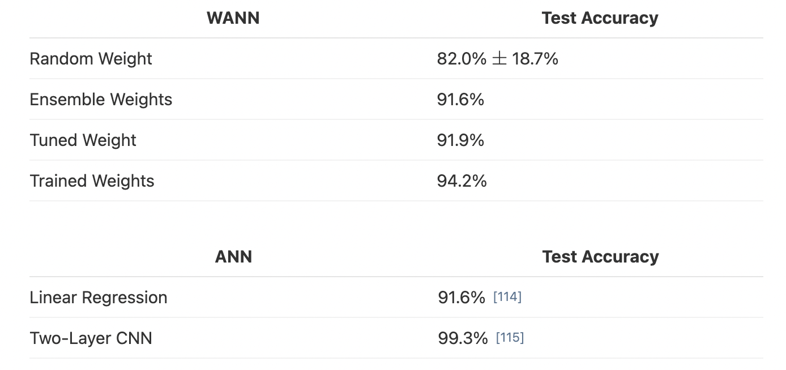

- # yang harus diexplore
- NEAT
	- <jelaskan neat lebih jelas di bab II>
-
- <dimana saja wann sudah pernah diaplikasikan, dimana bagusnya>
	- WANNs which encode relationships between inputs are well suited to RL tasks: low-dimensional inputs coupled with internal states and environmental interaction allow discovery of reactive and adaptive controllers. (Paper WANN)
	- [Continuous Control](https://arxiv.org/pdf/1906.04358.pdf -- WANN paper)
		- TLDR: works well
		- Salah satu bentuk task yang diselesaikan dengan reinforcement learning
			- CartPoleSwingUp
			- BipedalWalker-v2
			- CarRacing-v0
		- diukur performance nya dengan:
			- 1.  Random weights:  individual weights drawn from U(−2,2)
			- 2.  Random shared weight:  a single shared weight drawn from U(−2,2).
			- 3.  Tuned shared weight:  the highest performing shared weight value in range U(−2,2)
			- TODO 4.  Tuned weights:  individual weights tuned using  population-based REINFORCE [112].
		- 
			- We compare the mean performance (over 100 trials) of the best weight agnostic network architectures vs fixed topology = SOTA for biped and car racing
			- In contrast to the conventional fixed topology networks used as baselines, which only produce useful behaviors after extensive tuning, WANNs perform even with random shared weights
		- And while WANNs are able to perform without training, this predisposition does not prevent them from reaching similar state-of-the-art performance when the weights are trained.
			- **jadi hasil arsitektur terbaik ini bisa ditrain dengan cara biasa**
				- We can easily train each individual weight connection of our network by using the best shared weight as a starting point and solving for the offsets from the shared weight parameter. We used population-based REINFORCE [112] to fine-tune our weights, but in principle any learning algorithm can be used.
		- Bisa buat arsitektur yang as simple as possible
			- The biped controller uses only 17 of the 25 possible inputs, ignoring many LIDAR sensors and knee speeds. The best WANN architecture (below) not only solves the task without training the individual weights, but **uses only 210 connections, an order of magnitude fewer than commonly used topologies (2804 connections used in the SOTA baseline** [111]).
			- The architecture which encodes stable driving behavior in the car racer is also striking in its simplicity. **Only a sparsely connected two layer network** (below) and a single weight value is required to encode capable, but imperfect driving behavior.
		-
		-
	- [Classification](https://weightagnostic.github.io/)
collapsed:: true
		- 
		- hasilnya gak sebagus CNN (jelas)
		- TAPI
			- Restricted to a single weight value, WANNs are able to classify MNIST digits as well as a single layer neural network with thousands of weights trained by gradient descent
	- [Generative Adversarial Networks (GANs) using WANNs in Low-End Hardware](https://www.researchgate.net/profile/Fpj_Nijweide/publication/352738002_Exploring_the_feasibility_of_Weight_Agnostic_Neural_Networks_for_low-end_hardware/links/612fef622b40ec7d8bdc6757/Exploring-the-feasibility-of-Weight-Agnostic-Neural-Networks-for-low-end-hardware.pdf)
collapsed:: true
		- TODO GAN itu apa
			- deepfake(?)
		- The relevance of WANNs to this task is the fact that WANNs tend to reach high performance with very few hidden nodes, connected sparsely, and using only one weight.
		- Thus, **they are extremely small and very suitable for low-memory environments such as IoT devices**. Thus, they can be seen as an alternative to model compression
		- **Tapi setelah dicoba ternyata implementasi wann nya gak bagus (not an efficient code)**
			- However, we find that the existing **implementation of WANNs is problematic due
			  to inefficiencies in the code**, and the lack of certain features, with a desirable
			  overhaul outside of the scope for this project. The technique’s inherent difficulty in
			  exploring a large search-space of network structures for high-dimensional inputs
			  and outputs means that the ‘training’ of WANNs for GANs and more extensive
			  image classification is unsuccessful.
			- The implementation of the WANN framework required over 96 GiB of RAM for this process, while only 100 individuals were being used.
			- The original implementation of WANNs relies on **NumPy** matrices as representations of each neural network. This means that **the code is CPU-bound**—a gross inefficiency when working with large amounts of data and larger numbers of nodes
			- Instead, the code should be overhauled to express these genes using Tensorflow [30] or PyTorch [31] models which are inherently GPU-enabled. . The main reason why this was not done initially is presumably a result of **Tensorflow’s reliance on layers rather than individual nodes.** However, creating one-node layers and concatenating them should not be a problem, although we are unsure if this architecture would still make smart use of matrix multiplications.
			- the code implemented the **softmax activation for the output layer manually** rather than using the safe implementation provided by SciPy [32]. This implementation not only made
			  use of several matrix transpositions to the effect of illegibility and inefficiency, but it also exhibited underflows when huge negative numbers were provided to it in the company of small positive ones.
			- WANNs could be even smaller when storing edges as a list of tuples of nodes instead of an adjacency matrix.
		- Padahal, secara teori, memori yang diperlukan untuk WANN harusnya kecil
			- Consider a network with N nodes and C
			  edges. We can store the edges as a list of tuples with two nodes each, using 16 bits to represent a node (assuming that there are ≤ 65536 nodes). Using a list of size 16 · 2 · C for the edges instead of an adjacency matrix of size N^2 makes sense because WANNs have many nodes, but few edges.
			- the space needed to store a WANN, S, is:
			  S = (16 · 2 · C + 4 · N + 16 + 4) bits = (32C + 4N + 20) bits (2)
			  As an example, the WANN in Figure 4 takes up 1568 bits, while the dense network takes up (assuming 32 bits used for each weight, and 32 bits for each layer’s activation function) 88416 bits. This is a considerable reduction in size.
				- 
			- This suggests that, while the process of training WANNs is time and resource-intensive, **the resulting networks are both surprisingly performant and could be made extremely space-efficient**, which makes them ideal for constrained-memory environments.
		- Future works:
			- WANNs are currently based on a reimplementation of NEAT [11]. However, there have been many advances in Neural Architecture Search since then [16]. A considerable performance improvement in training WANNs could be found by using another NAS technique as a base for reimplementation, such as DARTS [14].
			- TODO apa itu DARTS
-
- <wann vs network pruning>
-
-
-
-
- # Bacaan Lain
- <untrained neural network>
	- <cari kelemahan/kelebihan wann terhadap untrained nn lain>
-
- cartesian genetic programming
	- neural architecture search terbaru
	- 5:24 PM
	  Wua, X., Zhanga, X., Jiaa, L., Chenc, L., Liangd, Y., Zhoua, Y., & Wua, C. (2021). Neural Architecture Search based on the Cartesian Genetic Programming. Neurocomputing, 1, 11.
	-
- NEAT untuk sentiment analysis
	- Hernández-Hernández, J. C., Mezura-Montes, E., Hoyos-Rivera, G. D. J., & Rodríguez-López, O. (2021, June). Neuroevolution for Sentiment Analysis in Tweets Written in Mexican Spanish. In Mexican Conference on Pattern Recognition (pp. 101-110). Springer, Cham.
-