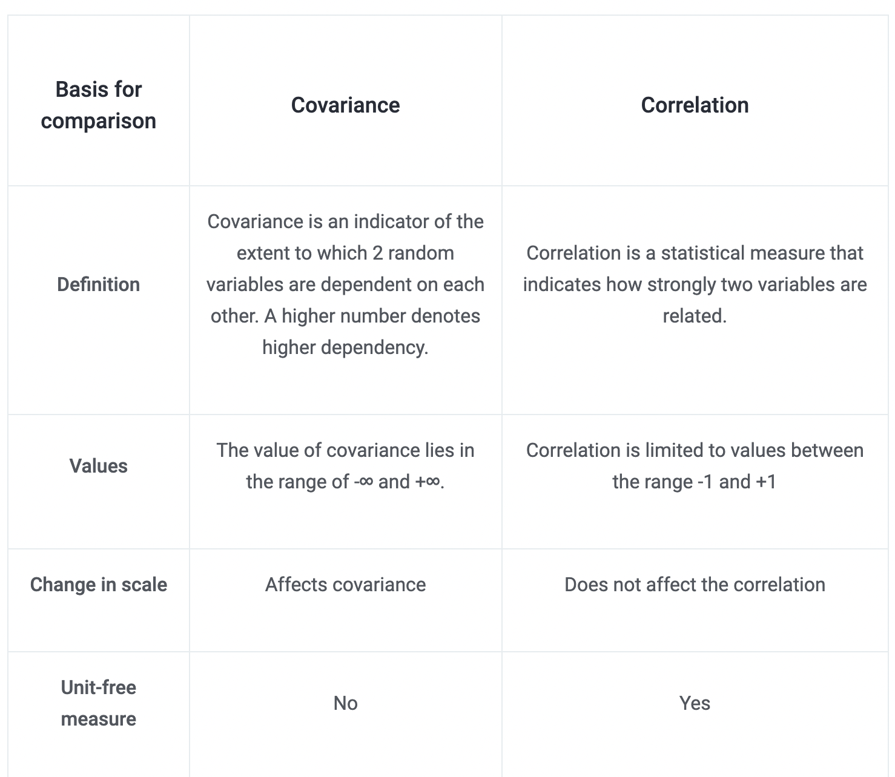

- What is Data and Business Analytics
	- breaking down dan mengstrukturisasi complex problem dan dataset untuk mendapatkan business insight dari data
	- careful thinking about evidence
-
- 
-
- Process of data analysis:
	- 
	-
	-
- Review Probabilitas dan Statistika
	- Mean and Median
		- tujuannya adalah mencari central tendency dari suatu kumpulan data
		- median lebih baik dari mean untuk data yang ber-pencilan
			- median tidak dipengaruhi dengan keberadaan pencilan
	- Variance
		- pengukuran terhadap penyebaran data dari nilai tengah
		- apa bedanya dengan standar deviasi?
	- covariance and correlation
		- covariance menunjukkan ukuran asosiasi dua variable
		- menunjukkan perubahan dalam satu variable akan memengaruhi perubahan di variable lain
		- 
	-
- EDA
	- univariate non-graphical
		- A simple tabulation of the frequency of each category is the best
		  univariate non-graphical EDA for categorical data.
		- Univariate EDA for a quantitative variable is a way to make preliminary assessments about the population distribution of the variablen using the data of the observed sample.
		- central tendency
		- spread
		- Skewness and kurtosis,
	- univariate graphical
		- histogram
		- stem-leaf plot
		- boxplot
		- quantile-normal plot
	- multivariate nongraphical,
		- correlation
		- covariance
		- cross tabulation
		- univariate stats by group data
		-
	- multivariate graphical.
		- univaraite stats by group data
		- scatterplot
		- boxplot
	-
- Measurement
	-
	-