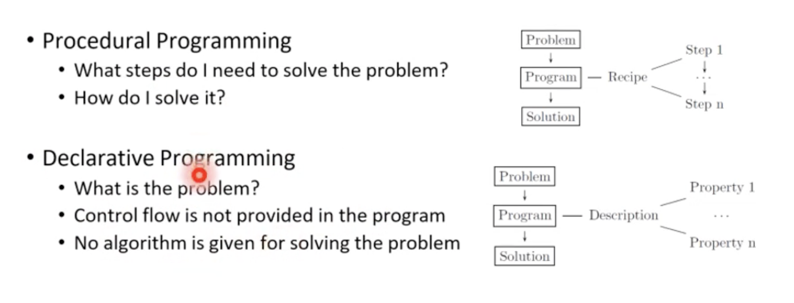
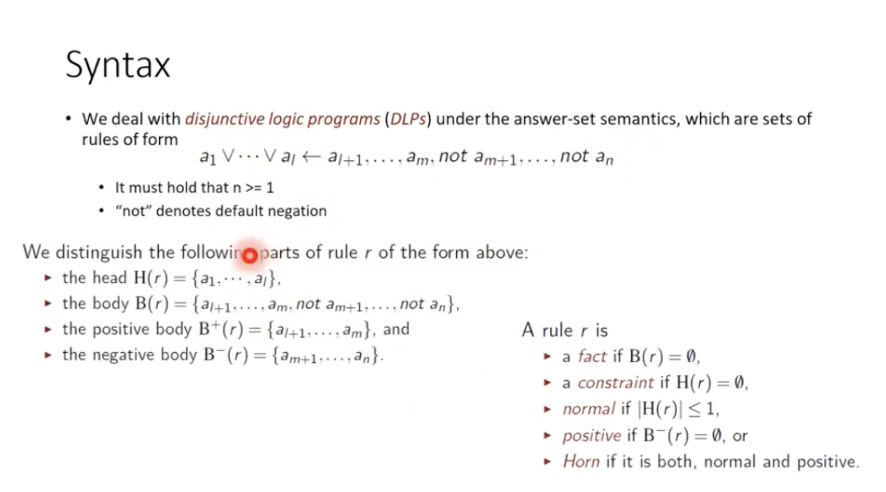
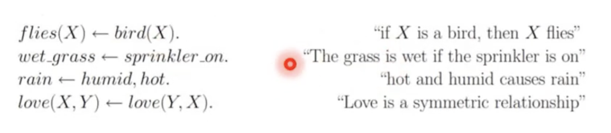
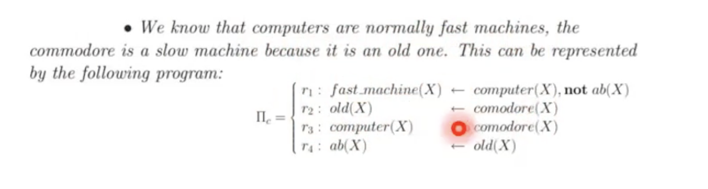
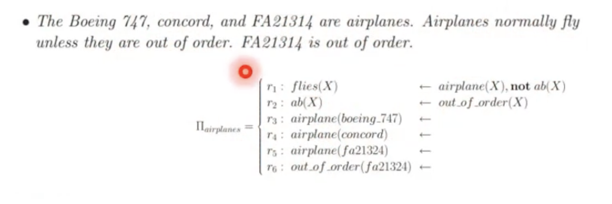

- bentuk declarative programming
- digunakan untuk menyelesaikan NP-hard search problem
- menghasilkan set of answers
	- disebut sebagai stable model
- menggunakan [[Autoepistemic Reasoning]] dan [[Default Reasoning]]
- domain aplikasi:
	- action and changes
	- planning
	- configuration
	- wire routing
	- semantic web
	- information integration
-
- Procedural vs declarative
- 
-
- Sifat:
	- problemnya diformulasikan dalam logic theory
	- melakukan komputasi terhadap suatu model
	- menggunakan prinsip non-monotonic reasoning
	- ability to express non-determinism
-
- Syntax:
	- menggunakan disjunctive logic (or)
	- 
	-
	-
- Contoh:
	- 
	- 
		- kalimat kedua itu jadi 3 rule, r2 - r4
	- 
		-
-
-
	-
-