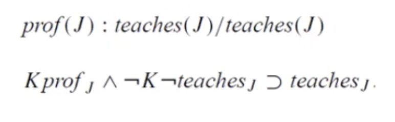
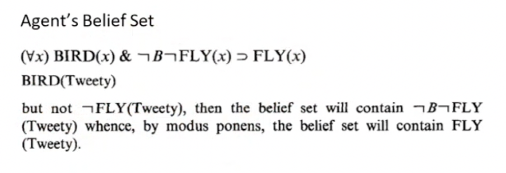

- Dibuat untuk menyediakan cara formal untuk bisa memasukkan sisi belief ke dalam knowledge base, given some assumptions
- Ciri khas dari autoepistemic adalah belief nya
- Notasi yang digunakan adalah K
	- contoh: K hujan(x)
		- saya yakin hari x akan hujan
	- 
	- artinya kita yakin prof j dan tidak meyakini bahwa dia tidak mengajar, maka j ngajar
-
- 
-
-