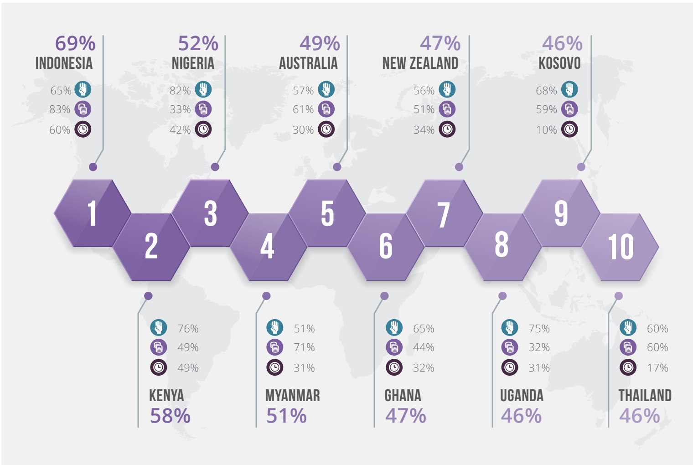
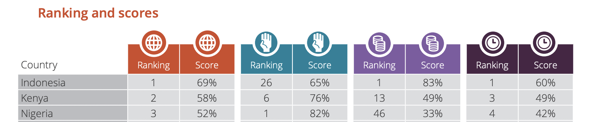

- Charities Aid Foundation World Giving Index 2021
- With the challenges of Covid-19 on charitable giving around the world, this year’s World Giving Index tells a truly remarkable story.
- 3 aspek
	- Helped a stranger, or someone you didn’t know who needed help?
	- Donated money to a charity?
	- Volunteered your time to an organisation?
	- {:height 406, :width 614}
	- {:height 140, :width 655}
	-
- There are a set of drivers that are contributing to this wider development:
	- Religion as a driver for giving
	- Local traditions and mutual aid
	- Wider government response
	- Digital transformation
	- Youth involvement, role models and the use of social media