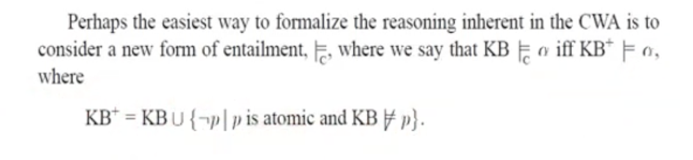
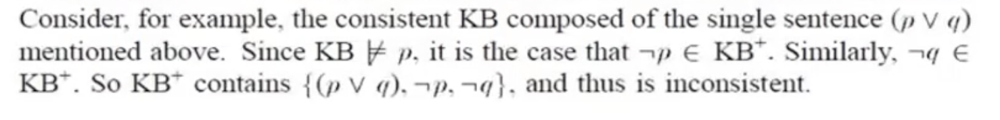

- Kecuali sebuah kalimat itu diketahui benar, maka bisa diasumsikan kalimat itu salah
- 
	- knowledge base tambahan adalah knowledge base yang sebelumnya ditambah notP dan KB tidak entails P (jika tidak ada sentence di KB yang entails bahwa p itu benar, berarti not p masuk ke KB)
-
- KB konsisten jhj tidak ada kalimat a yang bernilai a dan -a  dalam KB.
	- artinya tidak ada yang berkontradiksi
	- ketika KB konsisten, KB+ belum tentu konsisten
		- 
	-
-
- KB complete jhj untuk setiap kalimat a, minimal ada pengetahuan untuk a atau -a
	- artinya ada penjelasan untuk setiap kalimat dalam KB
-
-