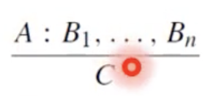
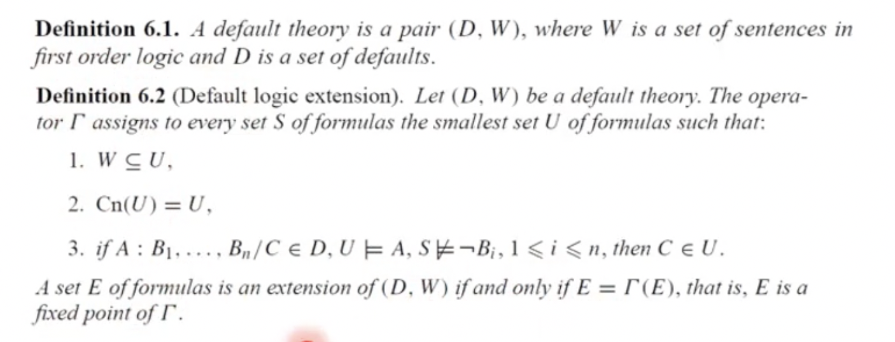

- Menggunakan default logic
- dimulai dengan memiliki knowledge base awal
	- lalu diturunkan menjadi set of implicit beliefs
		- penurunannya ini disebut sebagai entailment
-
- Notasi:
	- 
	- A disebut prerequisites/syarat
	- B1:BN disebut sebagai justifikasi/kondisi yang mendukung A
	- C adalah konsekuensi/hasil/kesimpulan
	-
- Default theory adalah pasangan (D,W) dengan d adalah defaultw dan W adalah set of sentence in FOL
	- 
	- arti dari 6.2 adalah, kita bisa membuat ekstensi dari default yang sudah ada, tidak seperti monotonic logic
	-
-
	- Cara representasi kedua: Default Logic
		- A:B / C
			- artinya: if A is true and it is consistent to assume B true, maka C
				- consistent to assume artinya bisa mengasumsikan B true
		- default logic melakukan default reasoning
			- mengambil kesimpulan rasional walaupun knowledge yang ada hanya sebagian
			- knowledge baru bisa menggagalkan kesimpulan sebelumnya
		- prototypical:
			- typically P is true, so it is safe to assume that P is true now
				- BIASANYA bener, jadi bisa lah dibilang sekarnag juga bener
		- No Risk
			- main aman
			- jika ada asumsi yang bisa benar bisa salah, tetap digunakan sebagai pengambil keputusan, untuk mengurangi risiko
			- jika hujan maka bawa payung, tapi sekarnag belum tentu hujan, yaudah bawa payung aja biar jaga2
		- Best guess
			- jika di dalam knowledge base tidak ada yang menjelaskan apakah P atau notP, maka diambil yang paling convenient
		- Probabilistic
			- jika P punya peluang lebih besar dari not P, maka anggap P true
	-