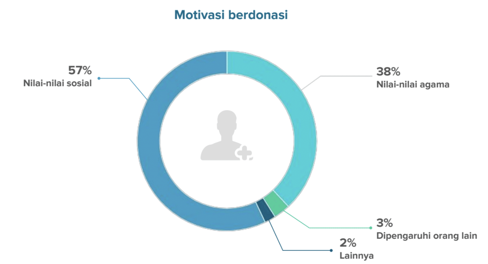
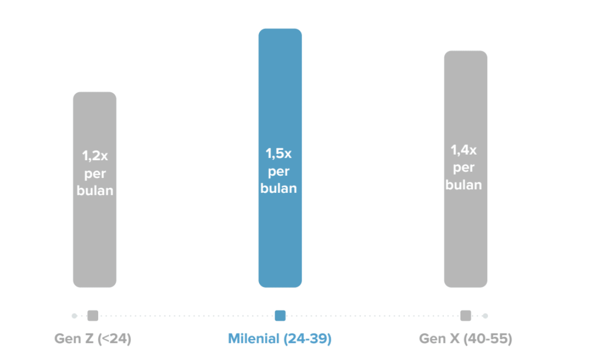

- The Portrait of Indonesians’ Donation Behaviour during the Pandemic
  https://filantropi.or.id/en/the-portrait-of-indonesians-donation-behaviour-during-the-pandemic/
- https://bit.ly/GOPAYDDO2020
-
- Menurut Gopay Digital Donation Outlook
	- during the current COVID-19 pandemic, it was noted that the acquisition of digital donations increased by 72%
	- Nilai sosial* dan nilai agama menjadi motivasi utama untuk berdonasi
		- {:height 234, :width 413}
		-
	- Generasi milenial lebih sering berdonasi dibandingkan dengan kelompok usia lainnya
		- {:height 281, :width 445}
-