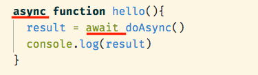
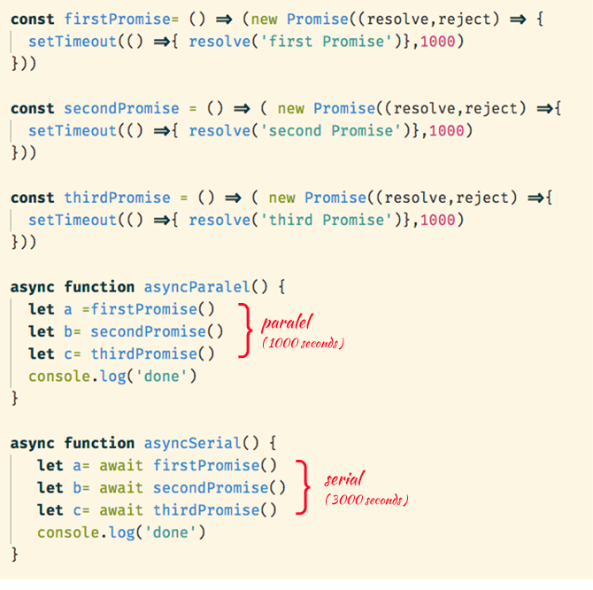

- Segari
	- via vp eng
- tokopedia
	- https://tokopedia.darwinbox.com/ms/candidate/applications
	- applied via  web
	- juni wfo
- efishery
	- https://efishery.com/en/job/backend-engineer/
	- applied via web and linkedin
- halodoc
	- java, go
	- https://glints.com/id/opportunities/jobs/backend-sde/7cafa7af-14cc-41a5-a4d0-4aaaa43336ee
- pinhome
	- https://www.pinhome.id/pages/career/
	- Working with several tech stacks, including golang, react.js, next.js, and flutter
	- ada ropi
	- applied via pm to cto
- sirclo
	- go, python, php
	- applied via linkedin pm to hr
- kitabisa
	- https://www.kalibrr.com/id-ID/c/kitabisa-com/jobs/179296/remote-senior-backend-engineer
- finantier
	- https://jobs.lever.co/Finantier/e19e199e-1ec3-4c80-aca8-ddbe4cfb81a8
- ruanggulag
	- https://jobs.lever.co/ruangguru/79957f90-2a79-4bf9-a1ae-044f6241f447
- bibit
- sayurbox
- ajaib
- schoters
-
-
- Interview
	- first of all, thanks for the interview opportunity
	- my name is denaya
	- 23 years old, currently lives in Bandung
	- i am a remote backend engineer in a startup called delman.io.
	- it's a big data enabler and provides data solutions focused on data preparation and integration across multiple big data sources.
	- I started working at delman.io since July 2020. It's almost 2 years now.
	- Before, i worked in kumparan, a digital media company as a data scientist
	- other than that, I worked as a freelance too, working for several companies building resource planning web dashboards. worked as the backend engineer and the deployment guy (i think you can call it a DevOps?)
	- Besides working full-time, I am currently studying for a master's degree in ITB in informatics and hopefully will graduate next year in 2023
-
- why quit?
	- learning curve, slow beginning, rapid learning, inflection point, learning becomes slow and effortful
		- i want to learn more, in this case, learn how to use Golang, specifically looking for a golang developer opportunity
	- new environment
		- making new friends, connections, im not going to work as employee forever, will make my own startup, want to learn stuffs behind it, make connections, friends, and experiencet
	- benefit
		- i mean, its pretty straightforward
-
- tech interview
	- API
		- application programming interface
		- menghubungkan satu aplikasi dengan aplikasi lain
		- jadi ketika satu aplikasi punya bahasa pemrograman yang berbeda dengan aplikasi lain, tapi mau transfer data, bisa pake API
		- REST api:
			- biasanya return json
			- client request dengan komponen: http method, endpoint, header, body
			- architectural concept
		- GraphQL:
			- mengatasi under/overfetching yang terjadi di rest api
			- query language
	- Docker
		- kemampuan untuk mengemas dan menjalankan sebuah aplikasi dalam sebuah isolated environment  yang disebut dengan container
		- Docker merupakan teknologi virtualisasi yang berada pada level sistem operasi. Berbeda dengan VM biasa yang merupakan teknologi virtualisasi pada level hardware.
		- tidak memerlukan sistem operasi secara penuh setiap kali menjalankan sebuah kontainer baru
		- docker compose:
			- tool untuk mengatur keberjalanan multiple container
			- misal perlu dependency
			- misal postgre dan redis perlu dijalankan sebelum worker/webserver.
			- kita gak perlu ngerun docker run satu2 container, jadi sudah dikemas dalam satu command
	- CI/CD
		- Continuous integration (CI) and continuous delivery (CD)
		- deployment steps are automated
		- The technical goal of CI is to establish a consistent and automated way to build, package, and test applications
			- kalau di tempat sekarang, setiap ngepush commit akan kecreate docker image baru, jadi ketika tim fe/product mau testing, tinggal ambil image dari container registry yang ada di gitlab
		- CD automates the delivery of applications to selected infrastructure environments
			- Most teams work with multiple environments other than the production, such as development and testing environments, and CD ensures there is an automated way to push code changes to them.
	- Sync vs async
		- synchronous:
			- kaya ngantre di bank, kalau dapet antrian ke 4 berarti akan dilayani setelah 1-3 selesai
		- async:
			- hasil eksekusi atau output tidak selalu berdasarkan urutan kode, tetapi berdasarkan waktu proses.
			- Daripada menunggu, asynchronous akan mengeksekusi perintah selanjutnya
			- tapi mungkin akan muncul kendala race condition
				- ketika next line dependent terhadap output dari prev line, disini biasanya menggunakan yang namanya async await
				- 
				- async → mengubah function menjadi asynchronous
				  await → menunda eksekusi hingga proses asynchronous selesai, dari kode di atas berarti **console.log(result) tidak akan di eksekusi sebelum prose doAsync( ) selesai**. await juga bisa digunakan berkali-kali di dalam function
			- Pada saat mengeksekusi beberapa proses asynchronous, ada kalanya kita harus memilih eksekusi secara serial atau parallel
			  {:height 326, :width 333}
	- SQL vs NoSQL
		- sql:
			- Relational databases model data as records in rows and tables with logical links between them
			- consistent language (walaupun beda dialect)
			- struktur: tabular
			- RDBMS are designed for fast transactions updating multiple rows across tables with complex integrity constraints
			- strict schema
		- nosql:
			- non-relational and generally do not use SQL
			- beda2 language tiap jenisnya
			- struktur: key-value (redis), document (mongodb), graph
			- Most SQL databases require you to scale-up vertically (migrate to a larger, more expensive server) when you exceed the capacity requirements of your current server. Conversely, most NoSQL databases allow you to scale-out horizontally, meaning you can add cheaper, commodity servers whenever you need to.
			-
			-
	- redis
		- Session state is stored as a key-value pair with user identifier as the key and session data as the value. This ensures that user sessions don’t access each others’ information.
		- salah satu penggunaannya: session management
			- login, server buat session id baru, lalu disave di redis db
			- session id dikirim kembali ke user dalma bentuk cookie header
			- setiap kali user pakai app, cookie dikirim ke server, server meriksa apakah session ada di redis
			- kalau gak ada, kembali ke login page
		-
	- elasticsearch
		- salah satu nosql
		- diguankan untuk searching
		- diquery dengan es rest api
		- disimpan dalam shard (horizontally scalable)
	-
	- message broker
		- Pub/Sub is commonly used to distribute change events from databases (data streaming). These events can be used to construct a view of the database state and state history in BigQuery and other data storage systems.
	-
- kalo masalah perpegawaian aku bilangnya ke siapa ya
- Aku berencana bulan ini jadi bulan terakhir kerja di delman
	- rencananya akan pindah ke pinhome
	- alasannya? aku rasa kaya gas ku udah habis di delman. aku merasa kurang produktif, kemungkinan besar karena burnout
		- ini bukan sama sekali karena lingkungan delman, aku suka banget sma delman
		- kayanya dari akunya perlu hal baru yang bisa buat lebih semangat lagi buat belajar
		- kalo diretain:
			- ini udah aku sempet pikirin juga
			- tapi kayanya aku gak akan ambil offer dari delman untuk ngeretain, aku mau coba hal baru, semoga bisa ningkatin semangatku juga. tapi bukan berarti kerjaan di delman jelek ya mas, enggak. aku suka bgt sma delman, cuma setelah lama pikir2 kayanya ini memang dari dalem diriku aja
	- ini belum kubilang ke mas ray dan mas david, apa aku perlu bilang atau mas one yang akan bilangin?
	-
	-
		-
		-
	-
	-
	-