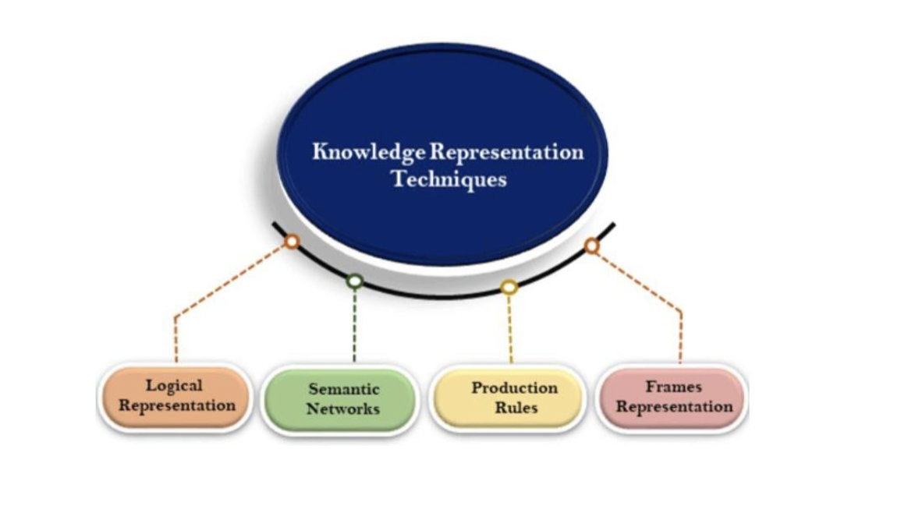

- Knowledge?
	- apa yang diketahui tentang dunia
	- Knowledge type:
		- Declarative knowledge
			- pengetahuan terhadap sesuatu yang pasti
				- concepts, facts, objects
			- disebut juga dengan descriptive knowledge
		- Procedural knowledge
			- pengetahuan tentang cara melakukan sesuatu
				- rule, strategy, procedure
			- disebut juga dengan imperative knowledge
		- Meta knowledge
			- pengetahuan terhadap pengetahuan lain
		- Heuristic Knowledge
			- pengetahuan yang didapatkan dari previous experience, walaupun belum dipastikan kebenarannya, tapi sudah terjadi
		- Structural knowledge
			- pengetahuan yang menjelaskan keterhubungan antar pengetahuan
	- Representation technique:
		- 
-
- Representasi pengetahuan:
	- bagaimana pengetahuan direpresentasikan secara simbolik
	- study concerned with using of formal symbols to represent collection of propositions
-
- Penalaran pengetahuan:
	- Bagaimana pengetahuan dimanipulasi/diinferensi melalui penalaran untuk menyelesaikan suatu masalah
-
- Properties of Knowledge representation:
	- Representational adequacy
	- Inferential adequacy
	- Inferential efficiency
	- Acquisitional efficiency
-
- Knowledge Representation:
	- [[Propositional Logic]]
	- [[Relational Logic]]
	- [[Non-Monotonic Logic]]
	-
-