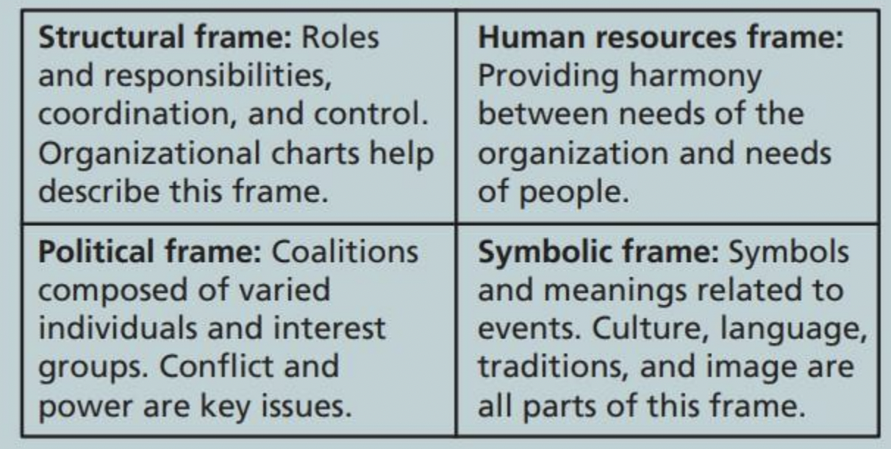
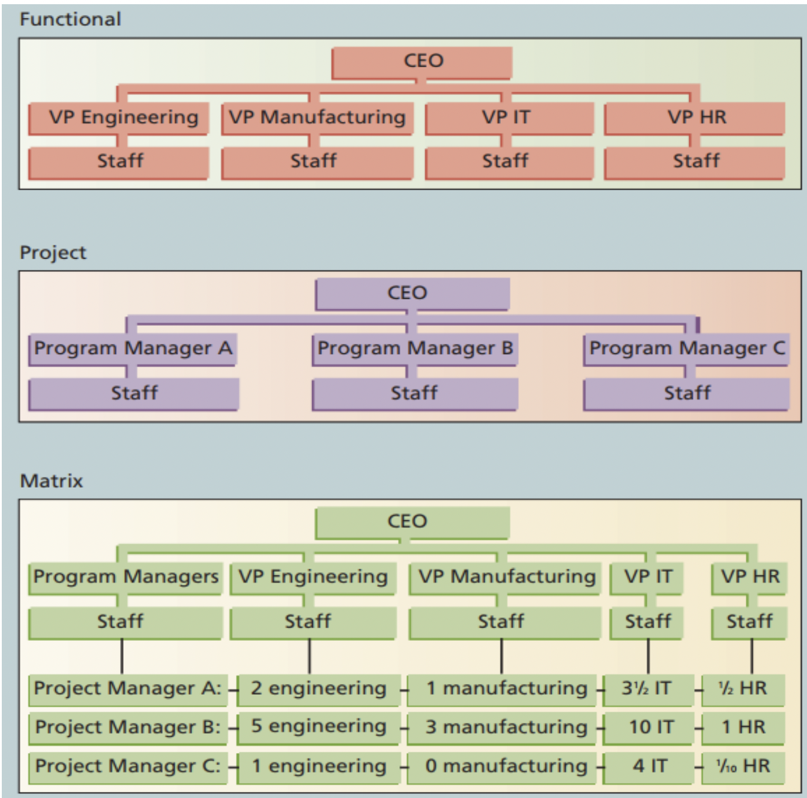
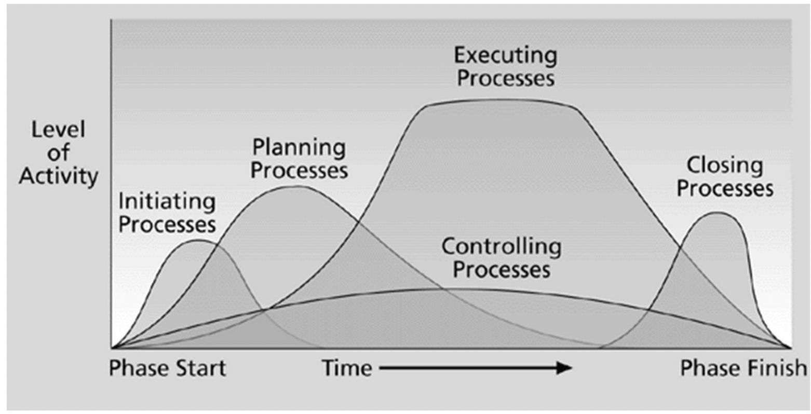
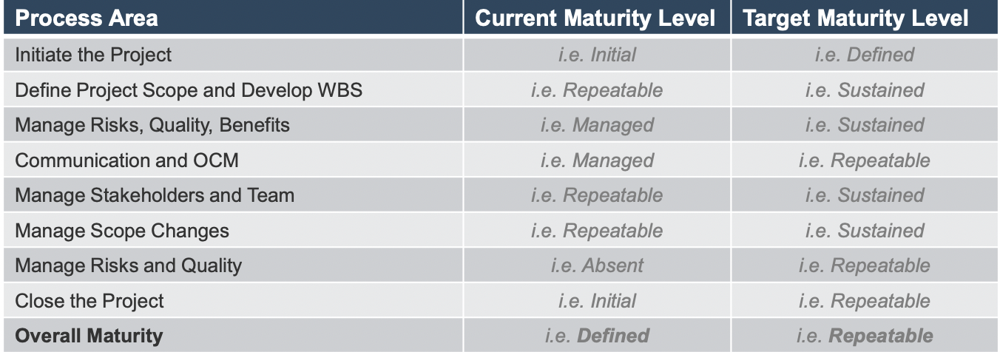
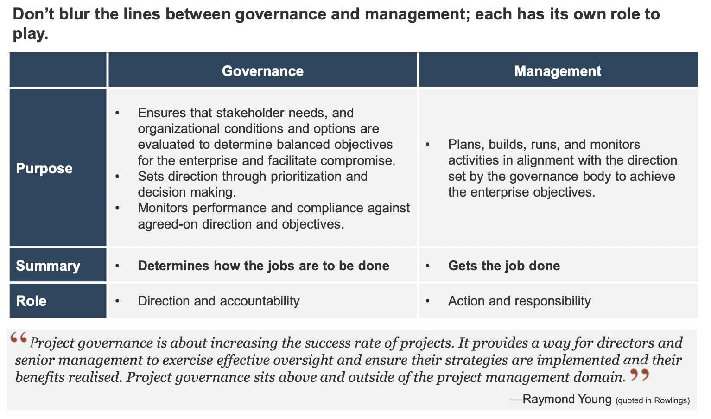
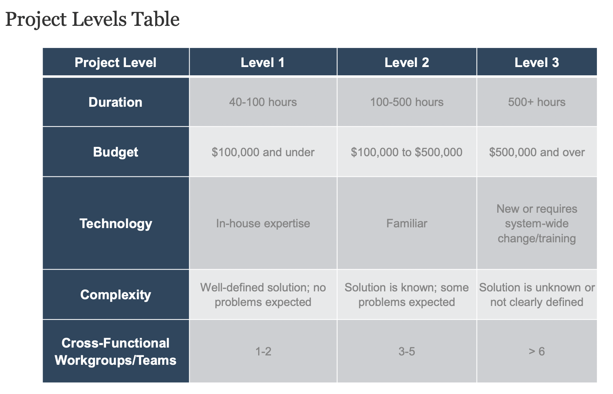
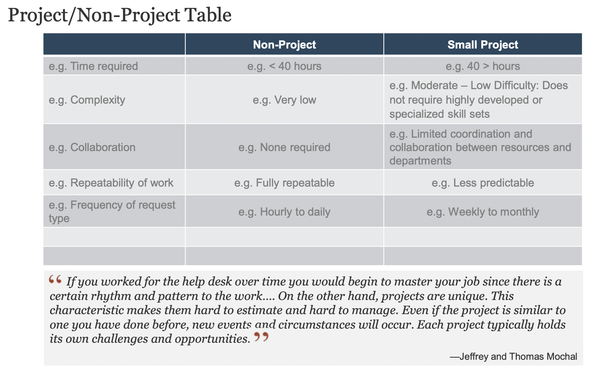

- Breakdown Materi MPSI here
-
- # Introduction
	- https://cdn-edunex.itb.ac.id/34400-Information-System-Project-Management/71148-Pertemuan-1---Pendahuluab/1642464182452_Microsoft-PowerPoint---01---IS-Project-Management.pdf
	- Objectives:
		- what is project? attributes of projects? triple constraint of project
		- elements of projects: stakeholders, pm knowledge area, common tools and techniques, project success
		- relationship between project, program, and portfolio management
		- role of project managers
		- project management professions
	-
	- What is project? #card
	  card-last-score:: 5
	  card-repeats:: 2
	  card-next-schedule:: 2022-05-20T07:20:00.305Z
	  card-last-interval:: 4
	  card-ease-factor:: 2.7
	  card-last-reviewed:: 2022-05-16T07:20:00.305Z
		- pekerjaan temporary untuk menghasilkan suatu produk, service, atau hasil tertentu
		- selesai ketika objektif nya tercapai
		- Attributes of project:
			- unique, uncertain, temporary
			- require resource, costumer, and sponsor
	-
	- Project stakeholders:
		- semua pihak yang berkepentingan dan terlibat dalam project
		- sponsor, manager, team, customer, user, supplier
	-
	- What is project management? #card
	  card-last-score:: 5
	  card-repeats:: 2
	  card-next-schedule:: 2022-05-20T07:19:49.001Z
	  card-last-interval:: 4
	  card-ease-factor:: 2.7
	  card-last-reviewed:: 2022-05-16T07:19:49.002Z
		- pengaplikasian  knowledge, skill, and technique ke suatu project untuk mencapai hasil yang baik
		- untuk mengatasi triple constraint
	-
	- What is project triple constraint? #card
	  card-last-interval:: 4
	  card-repeats:: 1
	  card-ease-factor:: 2.6
	  card-next-schedule:: 2022-05-20T07:19:35.593Z
	  card-last-reviewed:: 2022-05-16T07:19:35.594Z
	  card-last-score:: 5
		- Scope
		- Time
		- Cost Goal
	-
	- Tools and Techniques
		- assist project managers and
		  their teams
	-
	- Why do we need to learn project maangement? #card
	  card-last-score:: 5
	  card-repeats:: 2
	  card-next-schedule:: 2022-05-20T07:20:14.026Z
	  card-last-interval:: 4
	  card-ease-factor:: 2.7
	  card-last-reviewed:: 2022-05-16T07:20:14.027Z
		- teribble track recordd (banyak yang gagal)
		- reason for project failure: #card
		  card-last-interval:: 4.43
		  card-repeats:: 1
		  card-ease-factor:: 2.6
		  card-next-schedule:: 2022-05-20T17:20:15.366Z
		  card-last-reviewed:: 2022-05-16T07:20:15.366Z
		  card-last-score:: 5
			- poor dicipline
			- lack of executive level support
			- no linkage to business strategy
			- no evaluation metrics for success measurement
			- inability to manage change
			- no risk management
	-
	- Advantage of formal project maangement: #card
	  card-last-interval:: 4
	  card-repeats:: 1
	  card-ease-factor:: 2.6
	  card-next-schedule:: 2022-05-20T07:19:45.179Z
	  card-last-reviewed:: 2022-05-16T07:19:45.179Z
	  card-last-score:: 5
		- better control for resources
		- higher quality
		- higher reliability
		- risk managed
		- better internal coordination
	-
	- What is a program #card
	  card-last-interval:: 4
	  card-repeats:: 1
	  card-ease-factor:: 2.6
	  card-next-schedule:: 2022-05-20T07:19:31.710Z
	  card-last-reviewed:: 2022-05-16T07:19:31.711Z
	  card-last-score:: 5
		- group of related projects
		- managed in coordinated way to obtain benefit dibandingkan dimanage masing2
		- program managers: kepala dari beberapa project managers
	-
	- bedanya project management dan project portfolio management? #card
	  card-last-interval:: 4
	  card-repeats:: 1
	  card-ease-factor:: 2.6
	  card-next-schedule:: 2022-05-20T07:19:32.929Z
	  card-last-reviewed:: 2022-05-16T07:19:32.929Z
	  card-last-score:: 5
		- As part of project portfolio management, organizations
		  mengelompokkan dan manage projects and programs as a portfolio of
		  investments that contribute to the entire enterprise’s success
		- kita bisa lihat project portfolio sebagai laporan hasil akhir tiap project
		- portfolio ini bisa digunakan untuk melakukan strategic planning untuk perusahaan ke depannya
		-
	-
	- Best practice of project management #card
	  card-last-interval:: 4
	  card-repeats:: 1
	  card-ease-factor:: 2.6
	  card-next-schedule:: 2022-05-20T07:19:37.225Z
	  card-last-reviewed:: 2022-05-16T07:19:37.225Z
	  card-last-score:: 5
		- Make sure your projects are driven by your strategy
		- each project you undertake should fits your business strategy
		- screen out unwanted projects as soon as possible
		- Engage your stakeholders
		-
	-
	- What defines the success of a project #card
	  card-last-interval:: 4.14
	  card-repeats:: 1
	  card-ease-factor:: 2.6
	  card-next-schedule:: 2022-05-20T10:19:51.966Z
	  card-last-reviewed:: 2022-05-16T07:19:51.966Z
	  card-last-score:: 5
		- met triple constraint: scope, time, cost goal
		- satisfies customer
		- met its main objective
		- top trhee main reason of a success:
			- adequate funding
			- good expertise
			- engagement to stakeholders
	-
	- Role of PM #card
	  card-last-interval:: 4
	  card-repeats:: 1
	  card-ease-factor:: 2.6
	  card-next-schedule:: 2022-05-20T07:19:40.019Z
	  card-last-reviewed:: 2022-05-16T07:19:40.019Z
	  card-last-score:: 5
		- planning, scheduling, coordinating, and working with people
		- help influence success factors (3 aboves)
	-
-
- # Context
	- https://psg4-powerpoint.officeapps.live.com/p/pdfhandler.ashx?PV=0&Pid=WOPIsrc%3Dhttp%253A%252F%252Fpsg4%252Dview%252Dwopi%252Ewopi%252Eonline%252Eoffice%252Enet%253A808%252Foh%252Fwopi%252Ffiles%252F%2540%252FwFileId%253FwFileId%253Dhttps%25253A%25252F%25252Fcdn%25252Dedunex%25252Eitb%25252Eac%25252Eid%25253A443%25252F34400%25252DInformation%25252DSystem%25252DProject%25252DManagement%25252F77427%25252DPertemuan%25252D2%25252D%25252D%25252DProject%25252DMgt%25252D%25252DIT%25252DContext%25252F1643067772900%25255F02%25252D%25252D%25252DProject%25252DManagement%25252Dand%25252DIT%25252DContext%25252Epptx%26access%5Ftoken%3D1%26access%5Ftoken%5Fttl%3D0%26z%3D2de51b6ab70bedec44c1a06a9e64301ac1bd202dcd6dcfa4b1ff7c109e395ab6&useNamedAction=1&waccluster=PSG4
	-
	- objectives:
		- describe system view of project management
		- understand organization structures
		- explain why stakeholder management is imporntant
	-
	- system thinking
		- pm harus system thinking
		- project tidak bisa dikerjakan secara isolatif (gak nyambung ke perusahaan)
		- pm harus taking a holistic view of carrying out projects within the context of the organization
	-
	- system view of project management
		- system view: artinya adalah melihat untuk describe a more analytical approach to management and problem solving
	-
	- three part of system view: #card
	  card-last-interval:: 4.14
	  card-repeats:: 1
	  card-ease-factor:: 2.6
	  card-next-schedule:: 2022-05-20T10:19:54.971Z
	  card-last-reviewed:: 2022-05-16T07:19:54.972Z
	  card-last-score:: 5
		- system philosophy: an overall model for thinking about things as systems
		- system analysis:  problem-solving approach that requires defining the scope of the system, dividing it into components, and then
		  identifying and evaluating its problems, opportunities, constraints, and needs
		- system management: address business, technological, and organizational issues before making changes to systems
	- three sphere model of system management #card
	  card-last-interval:: 4
	  card-repeats:: 1
	  card-ease-factor:: 2.6
	  card-next-schedule:: 2022-05-20T07:19:29.998Z
	  card-last-reviewed:: 2022-05-16T07:19:29.999Z
	  card-last-score:: 5
		- business, organitzaiton, technology
		- Using a more holistic approach helps
		  project managers integrate business
		  and organizational issues into their
		  planning. It also helps them look at
		  projects as a series of interrelated
		  phases
		- Organizational issues are often the most difficult part of working on and managing projects
		- Many people believe that most projects fail because of organizational issueslike company politics
		- To improve the success rate of IT projects, it is important for project managers to develop a better understanding
		  of people as well as organizations
	-
	- four frame of organizations #card
	  card-last-interval:: 4
	  card-repeats:: 1
	  card-ease-factor:: 2.6
	  card-next-schedule:: 2022-05-20T07:19:38.791Z
	  card-last-reviewed:: 2022-05-16T07:19:38.792Z
	  card-last-score:: 5
		- untuk memahami organisasi, kita bisa lihat frame ini
		- {:height 202, :width 398}
	- Organizational structure: #card
	  card-last-interval:: 4.28
	  card-repeats:: 1
	  card-ease-factor:: 2.6
	  card-next-schedule:: 2022-05-20T13:20:07.912Z
	  card-last-reviewed:: 2022-05-16T07:20:07.912Z
	  card-last-score:: 5
		- functional
		- project
		- matrix
		- {:height 416, :width 436}
		-
	- Stakeholder management
		- top management adalah stakholder paling penting untuk pm
			- providing adequate resource
			- getting cooperation with another part of the company
			- mentoring and coaching leadership issue
	-
	- What is project lifecycle #card
	  card-last-interval:: 4
	  card-repeats:: 1
	  card-ease-factor:: 2.6
	  card-next-schedule:: 2022-05-20T07:19:27.995Z
	  card-last-reviewed:: 2022-05-16T07:19:27.996Z
	  card-last-score:: 5
		- collection of project phases that defines:
			- what work will be performed in each phase
			- what deliverable will be produced in each phase
			- who is involved
			- how the phase ends (how to approve)
	- Four phase of project lifecycle #card
	  card-last-interval:: 4.28
	  card-repeats:: 1
	  card-ease-factor:: 2.6
	  card-next-schedule:: 2022-05-20T13:20:12.612Z
	  card-last-reviewed:: 2022-05-16T07:20:12.612Z
	  card-last-score:: 5
		- starting
		- organizing and preparing
		- work
		- finish
	- five product lifecycle #card
	  card-last-interval:: 4.28
	  card-repeats:: 1
	  card-ease-factor:: 2.6
	  card-next-schedule:: 2022-05-20T13:20:04.495Z
	  card-last-reviewed:: 2022-05-16T07:20:04.495Z
	  card-last-score:: 5
		- predictive
			- semua keberjalanan dan stepnya sudah diprediksi di awal, sifatnya linier
		- iterative
			- time and cost estimates diubah secara iteratif, high degree of changes, low deliverable degree
		- incremental
			- low degree of change, high deliverable degree
		- adaptive
			- agile and change driven, tiap iterasi mengikuti perintah dan kemauan stakeholder
			- high degree of change, high degree of delivery
		- hybrid
			- gabungan dari beberapa yang di atas
	-
-
- # Process
	- https://psg3-powerpoint.officeapps.live.com/p/pdfhandler.ashx?PV=0&Pid=WOPIsrc%3Dhttp%253A%252F%252Fpsg3%252Dview%252Dwopi%252Ewopi%252Eonline%252Eoffice%252Enet%253A808%252Foh%252Fwopi%252Ffiles%252F%2540%252FwFileId%253FwFileId%253Dhttps%25253A%25252F%25252Fcdn%25252Dedunex%25252Eitb%25252Eac%25252Eid%25253A443%25252F34400%25252DInformation%25252DSystem%25252DProject%25252DManagement%25252F81969%25252DPertemuan%25252D3%25252DIT%25252DProject%25252DManagement%25252DProcesses%25252F1644277658693%25255F0301%25252D%25252D%25252DProject%25252DManagement%25252DProcess%25252DGroup%25252Epptx%26access%5Ftoken%3D1%26access%5Ftoken%5Fttl%3D0%26z%3Dc62929fbf529fc8f81e772dff53152f8ec94d3974beb278908f082e695657157&useNamedAction=1&waccluster=PSG3
	-
	- objective:
		- tau process groups
		- mapping process group to knoledge area
		- develop it management methodology
		- membandingkan predictive approach dan agile approach
	-
	- apa itu process group #card
	  card-last-interval:: 4.28
	  card-repeats:: 1
	  card-ease-factor:: 2.6
	  card-next-schedule:: 2022-05-20T13:20:01.678Z
	  card-last-reviewed:: 2022-05-16T07:20:01.678Z
	  card-last-score:: 5
		- process: series of action menuju particular objective
		- project management: can be viewed as number of interlinked processes
	- 5 PM process groups: #card
	  card-last-interval:: 4.43
	  card-repeats:: 1
	  card-ease-factor:: 2.6
	  card-next-schedule:: 2022-05-20T17:20:19.768Z
	  card-last-reviewed:: 2022-05-16T07:20:19.769Z
	  card-last-score:: 5
		- initiating process
		- planning
		- executing
		- monitoring and controlling
		- closing
		- 5 state ini sifatnya overlap, bukan serial
			- {:height 402, :width 342}
	-
		-
-
- # Groudwork for Project Success
	- https://cdn-edunex.itb.ac.id/34400-Information-System-Project-Management/83581-Pertemuan-4---groundwork-for-project-management-success/1644883007543_04--Tailor-Project-Management-Processes-to-Fit-Your-Projects--Phase-1-Lay-the-Gr.pdf
	-
	- groundwork: apa aja sih yang perlu dipersiapkan untuk project success
	- ada 3 tahap:
		- assess the current state of the pm processes
		- set a governance framework for project activity
		- develop project level and categories
	-
	- three tactical goals of project management:
		- planning and control
		- reporting
		- project governance
	-
	- apa fungsi SWOT analysis #card
	  card-last-interval:: 4.14
	  card-repeats:: 1
	  card-ease-factor:: 2.6
	  card-next-schedule:: 2022-05-20T10:19:50.414Z
	  card-last-reviewed:: 2022-05-16T07:19:50.415Z
	  card-last-score:: 5
		- defining apa saja tantangan, positif, negatif dari project yang akan dijalankan
	-
	- How to define process maturity level #card
	  card-last-interval:: 4.28
	  card-repeats:: 1
	  card-ease-factor:: 2.6
	  card-next-schedule:: 2022-05-20T13:20:02.999Z
	  card-last-reviewed:: 2022-05-16T07:20:02.999Z
	  card-last-score:: 5
		- triage tools
		- 5 maturity levels: absent, initial, defined, repeatable, managed
		- goal harus sesuai dengan maturity level
		- {:height 278, :width 396}
		-
	- apa itu project governance? #card
	  card-last-interval:: 4
	  card-repeats:: 1
	  card-ease-factor:: 2.6
	  card-next-schedule:: 2022-05-20T07:19:43.860Z
	  card-last-reviewed:: 2022-05-16T07:19:43.860Z
	  card-last-score:: 5
		- framework, function, and process that guide project management activities
	- apa perbedaan project governance dan project management #card
	  card-last-interval:: 4
	  card-repeats:: 1
	  card-ease-factor:: 2.6
	  card-next-schedule:: 2022-05-20T07:19:47.396Z
	  card-last-reviewed:: 2022-05-16T07:19:47.397Z
	  card-last-score:: 5
		- {:height 369, :width 607}
		-
		-
	- Apa aja project level? #card
	  card-last-interval:: 4.28
	  card-repeats:: 1
	  card-ease-factor:: 2.6
	  card-next-schedule:: 2022-05-20T13:20:11.077Z
	  card-last-reviewed:: 2022-05-16T07:20:11.077Z
	  card-last-score:: 5
		- dikategorikan berdasarkan besaran duration, budget, technology, complexity, dan cross-functional teams needed
		- project level 1
		- project level 2
		- project level 3
		- 
		-
		-
	- Apa yang membedakan project dan non project? #card
	  card-last-interval:: 4
	  card-repeats:: 1
	  card-ease-factor:: 2.6
	  card-next-schedule:: 2022-05-20T07:19:42.480Z
	  card-last-reviewed:: 2022-05-16T07:19:42.481Z
	  card-last-score:: 5
		- 
		-
		-
	-
		-
-
- # Review Kerjaan UTS
-
- # Integration Management
	- https://psg4-powerpoint.officeapps.live.com/p/pdfhandler.ashx?PV=0&Pid=WOPIsrc%3Dhttp%253A%252F%252Fpsg4%252Dview%252Dwopi%252Ewopi%252Eonline%252Eoffice%252Enet%253A808%252Foh%252Fwopi%252Ffiles%252F%2540%252FwFileId%253FwFileId%253Dhttps%25253A%25252F%25252Fcdn%25252Dedunex%25252Eitb%25252Eac%25252Eid%25253A443%25252F34400%25252DInformation%25252DSystem%25252DProject%25252DManagement%25252F88597%25252DModule%25252D8%25252DProject%25252DIntegration%25252DManagement%25252F1647301709857%25255F04%25252D%25252D%25252DProject%25252DIntegration%25252DManagement%25252Epptx%26access%5Ftoken%3D1%26access%5Ftoken%5Fttl%3D0%26z%3D7e7c2715f4728793c1fcfb03ef9d226c3294b66e75520d0c9c675923bf32b2fb&useNamedAction=1&waccluster=PSG4
	-
	- [[Project Integration Management]]
-
- # Scope Management
-
- # Time Management
-
- # Cost Management
-
- # Quality Management
-
- # HR Management
-
- # Risk Management
-
-