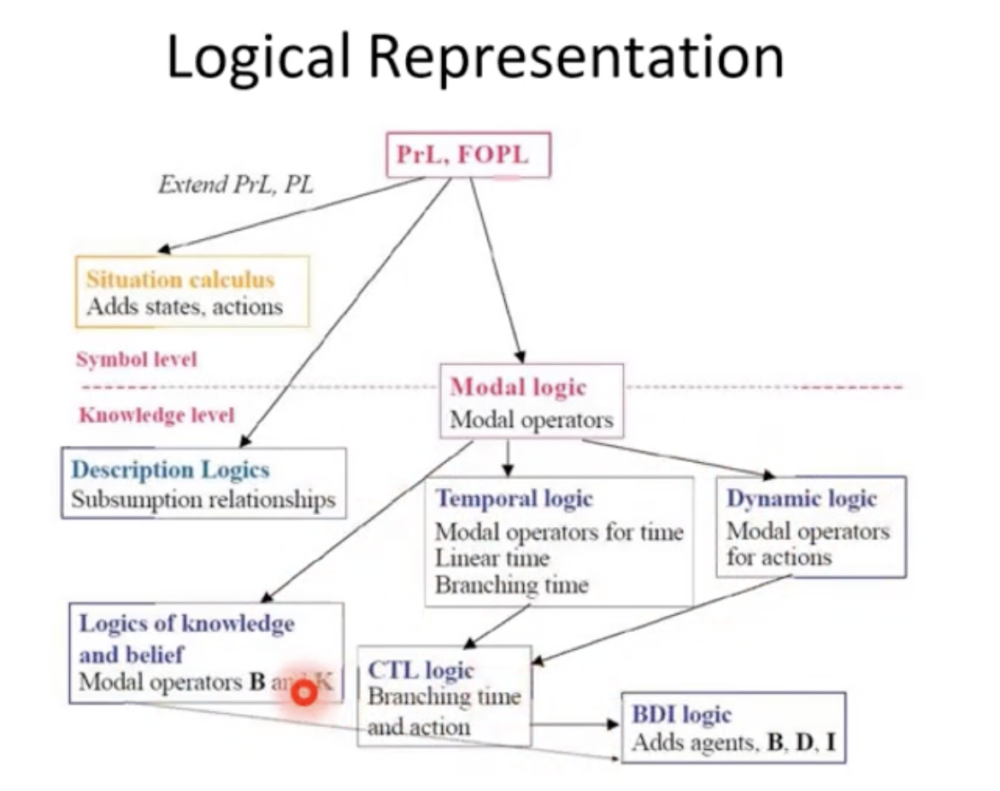

- Dalam proportional logic, asumsi satu environment mengandung **fakta-fakta**.
- Dalam first-order logic (like natural language), environment mengandung:
	- object
	- relasi
	- fungsi
-
- Dalam non-monotonic logic:
	- Pertama kita pahami istilah2 ini:
		- Axioms
			- Adalah sesuatu yang sudah kita yakini kebenarannya, tanpa harus dipertanyakan lagi
		- Soundness
			- sistem logika dikatakan 'sound' apabila setiap teoremanya valid secara logika. (tautology)
		- completeness
			- dikatakan complete ketika setiap tautologinya adalah teorema.
			- artinya adalah setiap valid staement dalam logic dapat dibuktikan dari dengan menerapkan aturan2 deduksi dari axiom yang ada
		- decidability
			- suatu logical system disebut decidable ketika ada algoritma yang bisa menentukan suatu formula adalah teorema atau bukan.
			- ketika komputer bisa menentukan apakah ekspresi sistem logika tersebut valid atau bukan
		- Monotonicity
			- suatu sistem logika dikatakan monoton ketika suatu sistem yang sudah terbukti benar dan ditambahkan suatu asumsi lain, maka sistem tersebut tetap benar.
			- tidak ada asumsi yang bisa mengubah validitas sistem logika monoton
			- walaupun asumsi yang baru itu kontradiktori terhadap asumsi yang sudah ada di dalam logic system nya.
-
- 
	-
- Pendekatan Proportional logic dan first order PL disebut sebagai classical logic.
	- namun ada beberapa persoalan yang dihadapi
		- ukuran dari teori untuk menjelaskan situasi real itu terlalu besar
		- sangat jelek menjelaskan sesuatu jika knowledge yang diketahui itu tidak lengkap
		- terlalu kaku terhadap knowledge baru (atau conflicting new knowledge)
			- tidak fleksibel
-
- logika klasik itu disebut sebagai monotonic logic
	- diberikan D fakta dan menghasilkan kesimpulan s
	- jika diberikan D' dengan D bagian dari D', maka D' akan menghasilkan s juga
	- dengan kata lain s adalah kesimpulan logika untuk setiap superset dari D
-
- jaman sekarang, classical logic itu dikatakan 'tidak cukup' karena sangat kaku
	- pakai contoh yang tadi
	- misal s sudah dibuat dari D
	- lalu ada tambahan D' yang sebenarnya membuat seharusnya s itu tidak benar
	- tapi karena monotonik, D' juga menghasilkan S.
	-
- makanya muncul Non-Monotonic logic
	- dibangun sengaja lebih fleksibel untuk menangani kondisi dimana pengetahuan yang ada tidak lengkap
	- pendekatannya deklaratif (sama dengan monotonic logic)
		- secara syntax dan semantic
-
- Contoh non-monotonic logic
	- knowledge:
		- biasanya burung terbang
		- penguin tidak terbang
		- tweety burung
	- kesimpulan: tweety terbang
	- misal sekarang kita tambahkan tweety adalah penguin
	- kesimpulan baru: tweety tidak terbang
	-
- General form of NML:
	- given A in the absence of B, infer C
		- A akan menghasilkan C ketika B tidak ada di knowledge base
-
- Tipe NML reasoning type:
	- Autoepistemic reasoning
		- explicit
		- subjective
	- Default Reasoning
		- prototypical
		- no-rik
		- best guess
		- probabilistic
-
- Autoepistemic reasoning:
	- incomplete representation of complete knowledge
	- sangat bergantung dengan konteks
	- prinsip utama:
		- P is valid kecuali ada yang menghasilkan kesimpulan/mengarah ke notP
	- menggunakan explicit convention
		- 'the next lecture will be thursday'
		- kesimpulan: lecture selalu kamis UNLESS we are told otherwise
	- Bersifat subjectiv
		- ada unsur belief di dalam knowledge base nya
		- contoh:
			- sekarang masih pandemi
				- kesimpulan: kita akan selalu berpikiran bahwa sekarang masih pandemi SAMPAI/UNLESS ada yang mengatakan bahwa sekarang sudah tidak pandemi
-
- Cara representasi kedua: Default Logic
	- A:B / C
		- artinya: if A is true and it is consistent to assume B true, maka C
			- consistent to assume artinya bisa mengasumsikan B true
	- default logic melakukan default reasoning
		- mengambil kesimpulan rasional walaupun knowledge yang ada hanya sebagian
		- knowledge baru bisa menggagalkan kesimpulan sebelumnya
	- prototypical:
		- typically P is true, so it is safe to assume that P is true now
			- BIASANYA bener, jadi bisa lah dibilang sekarnag juga bener
	- No Risk
		- main aman
		- jika ada asumsi yang bisa benar bisa salah, tetap digunakan sebagai pengambil keputusan, untuk mengurangi risiko
		- jika hujan maka bawa payung, tapi sekarnag belum tentu hujan, yaudah bawa payung aja biar jaga2
	- Best guess
		- jika di dalam knowledge base tidak ada yang menjelaskan apakah P atau notP, maka diambil yang paling convenient
	- Probabilistic
		- jika P punya peluang lebih besar dari not P, maka anggap P true
-
- Contoh:
	- kapal biasanya bisa nyebrang
	- sekarang, ada suatu kapal A, bisakah A nyebrang?
		- yes, aku harusnya tau kalo terjadi apa2 di A, karena aku ga tau, berarti aman2 aja (subjective autoepistemic)
		- yes, TYPICALLY biasanya kapal bisa nyebrang (prototypical)
		- yes, no other way to do it and i have to cross the river (best guess)
-
- Reasoning NML
	- [[Default Reasoning]]
	- [[Autoepistemic Reasoning]]
	- [[Closed World Reasoning]]
	- [[Circumscription]]
-
- Contoh fungsi non monotonic logic:
	- [[Answer Set Programming]]
	-