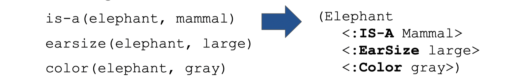
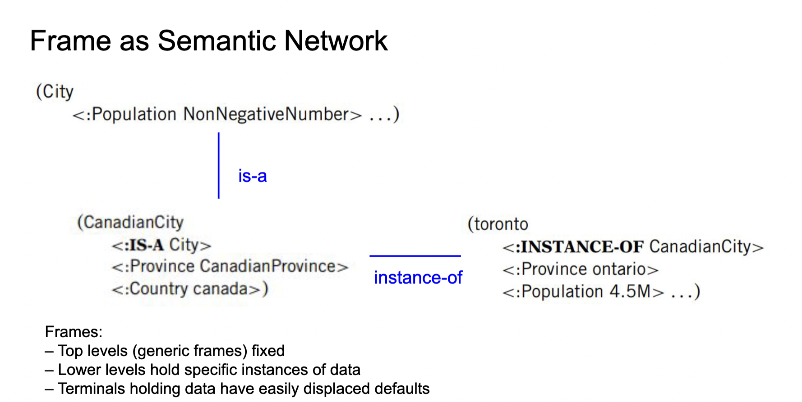
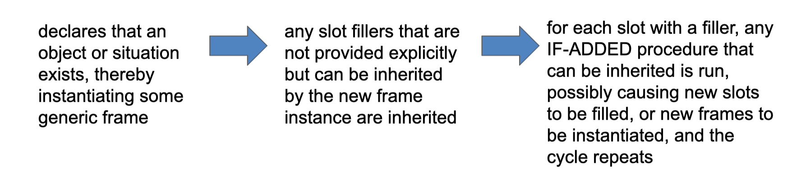
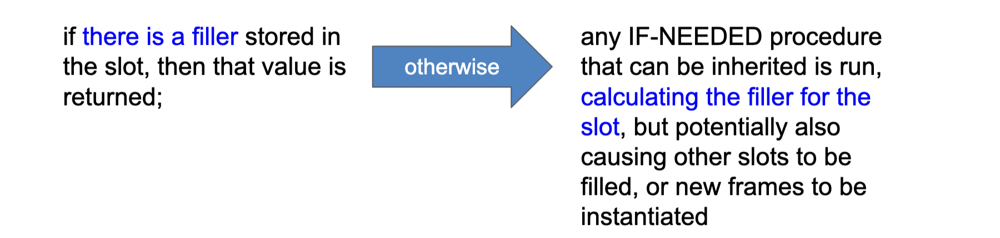
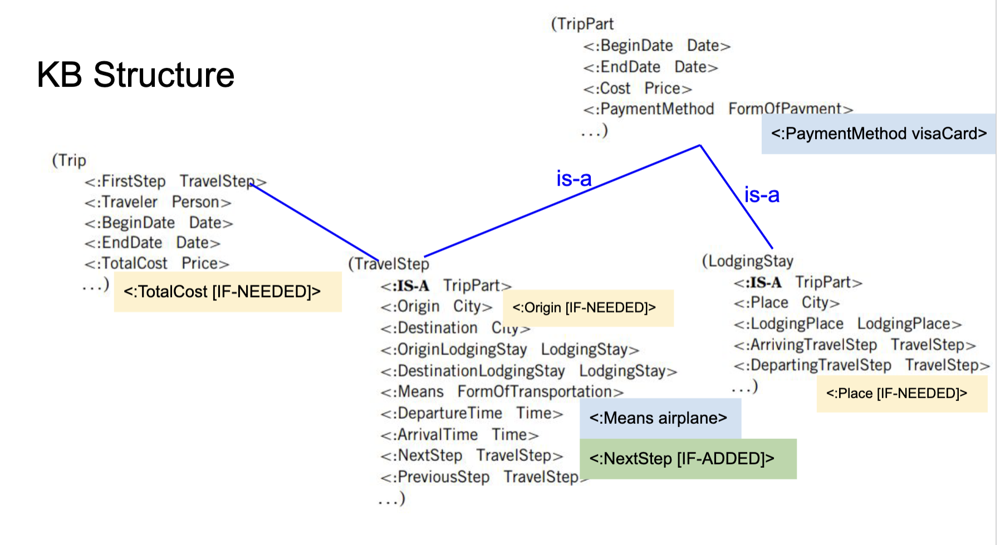

- **Bentuk dari executable network dalam semantic network**
- As the number of sentences or procedures in a KB grows, it becomes
  critical to organize them in some way
	- general knowledge representation itu bentuknya **flat dan scattered**, jadi knowledge nya besar dan susah ngedebug
	- 
- A more representationally motivated approach would be to group facts or rules in terms of the kinds of objects they pertain to
- Indeed, it is very natural to think of knowledge itself not as a mere collection of sentences, but rather as structured and organized in terms of what the knowledge is about, the objects of knowledge
-
- Object and Frames:
	- procedural knowledge representation formalism and object oriented
	- Frames:
		- dirancang untuk merepresentasikan ketika knowledge kita bermain dengan **stereotype** (ada atribute generalization untuk setiap instance nya)
		  collapsed:: true
			- ketika terjadi exception, kita akan membuat generic frame yang baru
			- karena banyak bermain dengan stereotype, instance di dalem frame banyak default value nya
		- salah satu jenis executable semantic network
		  collapsed:: true
			- merepresentasikan pengetahuan dalam bentuk graf (node and vertex/arcs)
		- two types of frames:
		  collapsed:: true
			- **generic frames**
			  collapsed:: true
				- bisa dipandang sebagai **superclass / baseclass**
				- 
				- We say that the generic frame is a specialization of the more general one, for example, CanadianCity is a specialization of City.
				- (Generic frame adalah superclass dari frame bawahnya)
				- Slots of generic frames can also have attached procedures. In the
				  simple case we consider here, there are two types, IF-ADDED and
				  IF-NEEDED,
					- bisa dipandang sebagai settattr (iF-ADDED) dan getattr (IF-NEEDED)
					- 
			- **individual frames**
			  collapsed:: true
				- bisa dipandang sebagai **instance** of generic frame
					- karena instance, ga ada settattr dan getattr nya
				- An individual frame is a named list of “buckets” into which values can be dropped
				- the buckets are called slot (variable)
				- items to go into are fillers (value)
				- 
				- Notationally, the names of generic frames appear here capitalized,
				  while individual frames will be in uncapitalized mixed case. Slot names
				  will be capitalized and prefixed with a “:”. For example, we might have
				  the following frames:
				- 
				- We say that the individual
				  frame is an instance of the generic one, so, in the example, toronto is an
				  instance of CanadianCity.
		- 
		  collapsed:: true
			-
		- Reasoning with Frames
		  collapsed:: true
			- ada tiga step:
				- 1. Create individual instance
				  2. filling fillers slot with values (with default values, inherited value, or manual filling)
				  3. inferring some other values (IF-ADDED, IF-NEEDED)
			- Reasoning loop in frame system:
				- 
			- Query filler of slot:
				- 
				- ketika dua step di atas ga ada hasilnya, maka value nya diset UNKNOWN
				-
		- Examples:
			- 
			-
	-