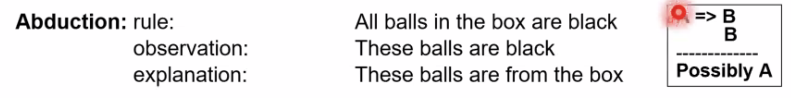

- pembuatan kesimpulan dari peluang
	- salah satu bentuk representasi pengetahuan
-
- Abduction:
	- reasoning/inferensi yang menghasilkan hipotesis dari kumpulan fakta yang ada
	- 
	- wlaupun begini, kita bisa ambil keputusan dengan probability of A
	- disebut probabilistic reasoning
		- atau bayesian reasoning
-
-