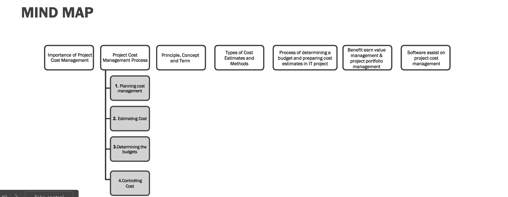
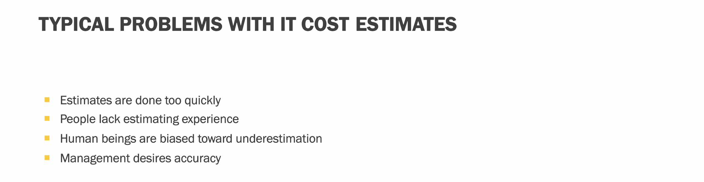
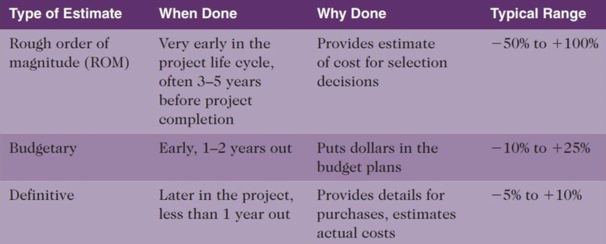
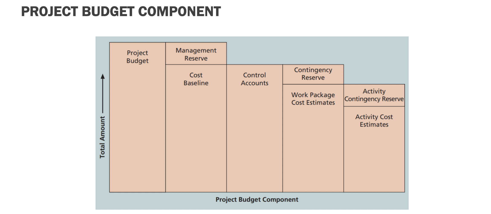

- Biaya yang kita keluarkan untuk menghasilkan suatu deriverable product
- Untuk mempersiapkan berapa jumlah uang yang harus dipersiapkan, dan juga biaya yang tidak berdampak langsung tapi harus tetap dipersiapkan, seperti biaya jaga2
- menghindari kerugian setelah deriverable
- {:height 295, :width 749}
-
- Cost:
	- sumber daya yang dikorbankan untuk mencapai tujuan spesifik
	- biasa satuannya adalah rupiah
	- project cost management: bagaimana memanage agar biaya yang sudah ditetapkan tidak berlebih dan tidak kurang, artinya dalam range yang tepat
-
- Project cost management process:
	- planning
		- uses expert judgement, analytical techniques, and meetings
	- estimating
		- 
		- {:height 229, :width 547}
	- determining budget
		- 
	- controlling cost
		-
-
- Basic principles of cost management:
	- profit
	- profit margin:
		- rasio pendapatan terhadap keuntungan
	- lifecycle costing
		- mempertimbangkan total biaya kepemilikan + support
	- cashflow analysis
		- menetapkan perkiraan biaya tahunan
	- reserves
		- cadangan uang untuk mitigasi risiko, meringankan kemungkinan terjadinya gagal deliver product
		- contingency reservers: known unknown
		- management reservers: unknown unknown
	-
- type of costs:
	- tangible cost (biaya nyata)
		- biaya atau manfaat bagi organisasi yang dapat diukur secara mudah
		- contoh: bahan baku produk pisang goreng
	- intangible cost
	- direct cost
	- indirect cost
		- nonrelated to product (contoh; traktiran stakeholder)
	- sunk cost
	-
- next: [[Project Quality Management]]
	-
	-
	-