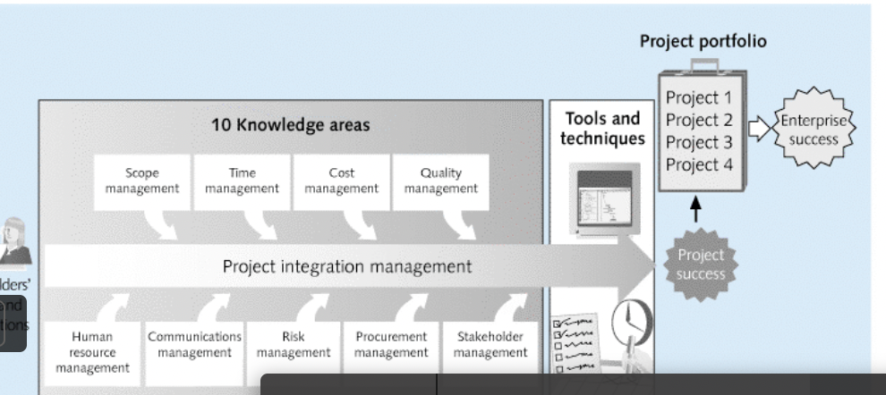
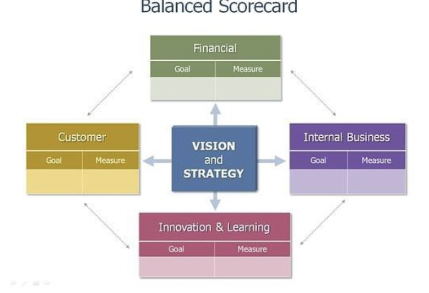
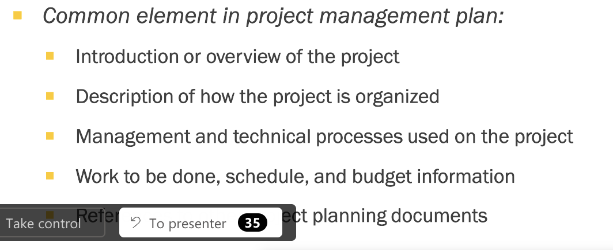

- Kita harus mengelola seluruh sumber daya secara utuh dan menyeluruh
	- agar biaya efisien
	- dan pekerjaan selesai secara efektif
	- Integrasi lebih maju dibandingkan dengan hanya planning saja
	- koordinasi seluruh project management knowledge area
		- coordinating all people, plans, and work required to complete the project
-
- Project manager harus bisa melihat big picture
	- project integration management is not the same with software integration management
-
- Apa yang harus diintegrasikan oleh project manager dalam management ini?
	- 
	- procurement: pengadaan sumber daya
	- stakeholder management:
-
- Project integration management process;
	- 1. pembuatan PKS (project charter) dengan stakeholder
	  2. pembuatan rencana project management
	  3. directing and managing project (menjalankan poin 2)
	  4. mengelola pengetahuan tentang project dan mengelola pengetahuan baru
	  5. memonitor dan controlling project
	  6. mengatur perubahan ()change control) dalam projec
	  7. project closing
-
- Apa itu Strategic Planning?
	- menentukan masa depan perusahaan
	- menyesuaikan kondisi saat ini menuju kondisi masa depan
	- forecast apa yang akan terjadi di masa depan
		- menggunakan expert judgement
	- menentukan SWOT perusahaan
		- bisa menentukan strategi yang harus kita lakukan
			- bertahan atau menyerang
	- mengidentifikasi project apa yang bisa dilakukan
	- menentukan produk atau service apa yang harus dibuat untuk menghadapi masa depan
-
- Planning stages:
	- strategic planning
	- business area analysis
	- project planning
	- resource allocation
-
- Bagaimana cara memilih project?
	- (Dari sudut pandang perusahaan SaaS, bukan dari sudut pandang konsultan)
	- methods:
		- organization need
			- three important criteria: there is a need, there are funds, there is a strong will
		- categorizing it project
			- categories: problem, opportunity
		- financial analysis
			- Net present value analysis
			- return of investment
			- payback analysis (breakeven point)
		- weight scoring model
		- balance scorecard
			- {:height 404, :width 597}
		-
		-
- Bagaimana cara mengembangkan project charter (perjanjian kerjasama)
	- berisikan tanda tangan project stakeholder utama
	-
- Bagaimana cara membuat rencana manajemen proyek
	- 
	-
- How to direct
	-
- How to monitor
-
- How to close a project