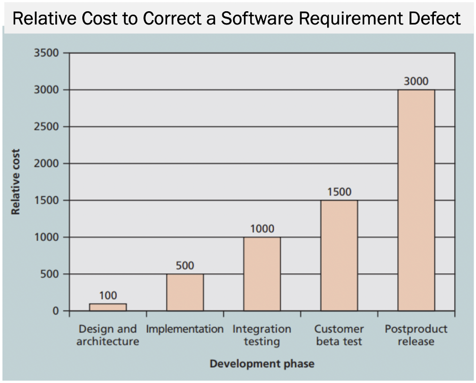
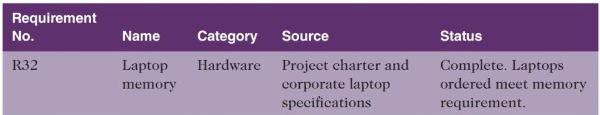
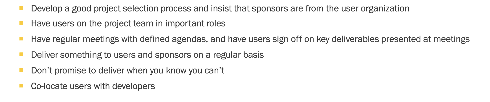

- Membatasi cakupan masalah dari project kita
- Seringkali project tidak berhasil karena di tengah jalan ada perubahan cakupan
	- pada prinsip project management, hal ini tidak dibenarkan
	- makanya ada project charter yang disepakati oleh kedua belah pihak
-
- What is PSM
	- menetapkan apa yang akan dihasilkan (deliverable product)
	- untuk menghasilkan produk tsb, apa saja yang harus dilakukan -> ini disebut sebagai project/product scope
	- PSM mencakup apa yang harus dilakukan dan apa yang tidak dilakukan untuk mencapai deliverable product
	- tujuan dari PSM agar kedua belah pihak (pm dan stakeholder) punya persepsi yang sama untuk produk yang akan dibuat dan cara yang akan dilakukan
		- sering kali pada saat melakukan identifikasi kebutuhan, stakeholder tidak membantu secara baik
	-
-
- Processes of PSM
	- Planning
		- Planning by expert judgement
		- Collecting requirements
			- requirement mencakup kondisi dan kapabilitas dari unit kerja yang akan melakukan pekerjaan ini dan harus dipenuhi
			- Sering kali saat berinteraksi dengan stakeholder, stakeholder menceritakan sesuatu yang bukan dibutuhkan dan tidak termasuk dalam scope kerja ini.
			- sangat penting karena semakin belakang kita menemukan defect dari requirement ny, makin besar cost nya
				- {:height 292, :width 355}
			-
		- Defining Scope
		- Creating the WBS
	- Monitoring and Controlling
		- Validating the scope
		- Controlling the scope
-
- Methods of Collecting Requirement
	- cara:
		- interview
		- fgd
		- group creativity
		- quesioner + survey via form
		- observation
		- prototyping/mockup
		- benchmarking
			- melakukan studi banding dengan organisasi yang setara dengan kita
	- statistics:
		- 88% sofware rpoject menggunakan produk yg sudah ada
		- 86% responden mengatakan most important metrics keberhasilan produk adalah kepuasan pelanggan
		- 75% responden menyatakan mereka sudah mengelola proyek dengan 100 reqs sedangkan 20% sudah mengelola 1000 reqs
		- 75% resp mengatakan 10%-25% waktu untuk mengelola perubahan reqs
		- 85% resp menggunakan ms office
	- requirement traceability matrix
		- matrix yang memungkinkan kita untuk melacak kembali
		- {:height 133, :width 621}
-
- Defining Scope
	- merupakan dasar untuk pengukuran kinerja proyek.
	- kita bisa tau kapan, berapa biaya, dan apa saja sumber daya yang diperlukan untuk menyelesaikan projek
	- harus mencakup:
		- definition
		- criteria penerimaan
		- informasi terperinci deriverable product
		- docs yang berisikan cakupan, asumsi, kendala, dll
	-
- Make a Project Charter
-
- Breakdown Structure
	- pengelempokan pekerjaan yang akan menghasilkan deriverable product
	- menjadi basis waktu, biaya, dan sumber daya yang diperlukan
	- deliverable product dipecah menjadi bagian kecil2 dengan paket pekerjaan terkecil disebut sebagai task
	- diambil dari project scope statement yang sudah dibuat dan disetujui di project charter
-
- Managing User Input
	- 
	-
-
-