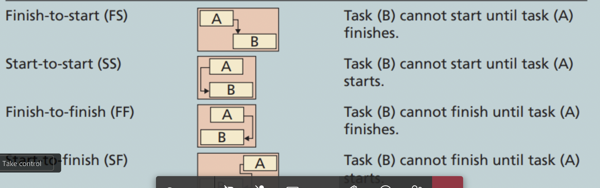

- Importance of Project Time Schedule
	- faktor penyebab keterlambatan:
		- faktor internal
			- issue dalam penjadwalan jadi masalah utama
			- individual workstyle and culture difference antar karyawan jadi schedule conflict
				- di dalem ini ada project maturity level, supaya bisa melihat apakah para individual bisa memenuhi kebutuhan dari project
			- project manager harus tau sifat individual terhadap deadline dan work ethic masing-masing
				- meyer briggs type indicator
		- faktor eksternal
-
- Process
	- proses pertama adalah planning schedule management
		- membuat policies, procedure, dan dokumentasi pelaksanaan dan pengendalian pekerjaan
	- defining activities
		- mengidentifikasi aktivitas tertentu yang anggota tim project dan stakeholder harus melkaukannya dengan baik untuk menghasilkan project derivable
	- sequencing activities
		- mengurutkan aktivitas yang ada, harus dilakukan secara fisik dan logic
		- memperkirakan aktifitas mana yang bisa dilakukan secara sequential atau harus seri
	- estimating activity resources
		- menentukan sumber daya apa saja yang diperlukan untuk aktivitas ini
	- estimating activity duration
		- memperkirakan lama waktu dengan cara memperkirakan banyaknya periode waktu tersedia untuk melengkapi aktivitas individual
	- developing schedule
		- menganalisis urutan aktivitas
		- memperkirakan kebutuhan sumber daya
		- memperkirakan panjang tiap2 aktivitas
	- controlling schedule
-
- Planning schedule management
	- biasanya menggunakan expert judgement, analytical technique, dan meeting untuk membangun scheudle plan
-
- Activities
	- adalaa task yang perlu waktu dan sumber daya
	- step untuk membuat schedule:
		- defining activity
			- dilakukan untuk memastikan apa saja yang harus diselesaikan untuk  project deriverable
		- sequencing
		- estimating resource and duration
-
- activity list milestone
	- terdiri dari:
		- name
		- identifier
		- brief description
	- juga menghubungkan predecessor, successor,
	- merupakan penanda apa saja activity yang sudah diselesaikan
-
- sequencing activities
	- menentukan dependency dan relationship antar activity
	- setelah itu bisa membuat critical path analysis
	- type of dependency:
		- mandatory
		- discretionary
		- external
		- internal
	- deendency bisa dinyatakan dalam bentuk diagram
		- Arrow diagram method
		- Precendence diagram method
	- task dependency type:
		- {:height 181, :width 554}
-
- activity duration estimation
	- time worked + elapsed time
	- bentuknya adalah estimation, bukan equation
	- three point estimates:
		- optimistic
		- most likely
		- pessimistic
-
- developing schedule
	- bis amenggunakan beberapa cara
		- gantt chart
		- critical path analysis
		- critical chain scheduling
		- PERT analysis
-
- menarik: 20 second rule (The hapiness advantage)
-
- Agile and Time Management
	-
- Next : [[Project Cost Management]]
-
-
-