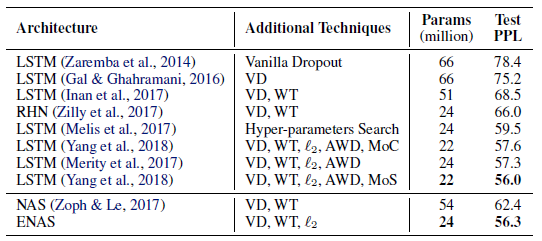

- Latar Belakang:
	- https://ieeexplore.ieee.org/abstract/document/9508774
		- Abstract:
		  Deep neural networks (DNNs) have achieved great success in many applications. The architectures of DNNs play a crucial role in their performance, which is usually manually designed with rich expertise.
		- However, such a design process is labor-intensive because of the trial-and-error process and also not easy to realize due to the rare expertise in practice.
		- Neural architecture search (NAS) is a type of technology that can design the architectures automatically. Among different methods to realize NAS, the evolutionary computation (EC) methods have recently gained much attention and success. Unfortunately, there has not yet been a comprehensive summary of the EC-based NAS algorithms.
		- This article reviews over 200 articles of most recent EC-based NAS methods in light of the core components, to systematically discuss their design principles and justifications on the design. Furthermore, current challenges and issues are also discussed to identify future research in this emerging field.
	- Topik, masalah, solusi-solusi atas masalah tersebut, masalah yang masih tersisa, dan usulan solusi atas masalah tersebut.
	- Arsitektur NN sangat berpengaruh dalam  arsitektur, dan pembangunan arsitekrunya memakan banyak waktu
	- makanya sekarang ada [[Neural Architecture Search]]
	- Tapi, di NAS, pembuatannya lama dan mahal karena ada inner loop untuk train params  nilai performance dari arsitekturnya
		- **_In addition, the inner loop for training the weights of each candidate architecture before evaluation makes neural architecture search computationally costly_** [sumber](https://weightagnostic.github.io/)
		- udah ada yang buat supaya computational freinldy
			- [[ENAS]]
			- Basically ENAS ini kaya NAS yang tiap generationnya itu adalah hasil transfer learning dari generation sebelumnya? jadinya iterasi di tiap generation lebih cepet
			- tapi ini kelemahannya apa?
				- tetep aja perlu retrain di tiap generation
				- Running on a single Nvidia GTX 1080Ti GPU, ENAS finds a recurrent cell in about 10 hours.
				- 
	- Setelah ini baru masuk [[Weight Agnostic Neural Network]]
		-
			-
			-
-
-
- [[NLP]] task
	- akan menyelesaikan salah satu task NLP
	- contoh:
		- sentiment analysis
		- text classification
		- autocompletion
		- text generation
-
- II.1 [[Recurrent Neural Network]]
	- Recurrent Neural Network adalah
	- Kapan RNN digunakan?
	  :LOGBOOK:
	  CLOCK: [2022-02-13 Sun 09:49:04]
	  :END:
	- Kelemahan RNN?
		- maka dari itu kita memerlukan LSTM
-
- II.2 Architecture Search
	- Dalam beberapa tahun terakhir, deep learning terbukti memberikan kinerja baik dalam berbagai jenis permasalahan, seperti image recognition, speech recognition, dan juga permasalahan NLP seperti machine translation, sentiment classifier, dan lain-lain. Salah satu hal krusial yang memengaruhi kinerja suatu model deep learning adalah arsitektur model. Namun, pencarian arsitektur yang baik memakan banyak waktu dan biasanya dilakukan dengan metode trial and error. Architecture search dibangun dan dikembangkan karena adanya permasalahan ini.
	- Architecture search merupakan ranah riset yang berfokus dalam pembuatan algoritma atau sistem yang mampu mencari arsitektur deep learning yang menghasilkan kinerja terbaik.
	- II.1.1 [[Neural Architecture Search]]
	- II.1.2 [[ENAS]]
	- II.1.3 [[Weight Agnostic Neural Network]]
		-
-