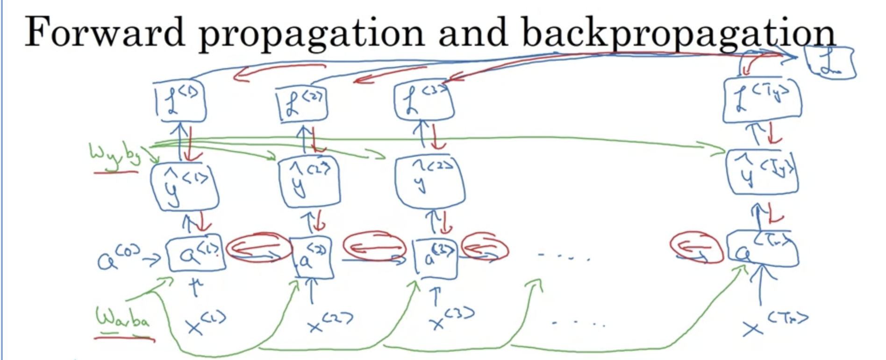

- Forward propagation: mencari nilai a dan y di tiap layernya
  
- nilai `w` digunakan secara sharing untuk setiap sequence, yang berbeda tiap sequence hanyalah `x`,`a`, dan `y`
-
- Loss function yang digunakan adalah cross entrophy
  
- Loss function dari keseluruhan sequence adalah jumlah dari loss masing2 bagian
-
- Lalu, dengan menggunakan loss function ini, kita bisa melakukan backpropagation through time yang berlawanan arah dengan forward propagation
- 
-