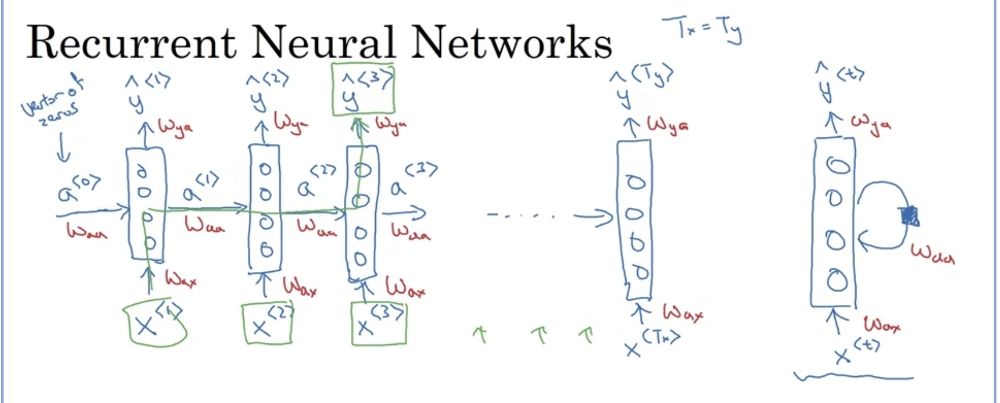

- RNN adalah salah satu bentuk [[Sequence Model]]
  https://www.simplilearn.com/ice9/free_resources_article_thumb/Network_framework.gif
- Misal kita ingin membuat POStagger dari satu kalimat `x_i` yang menghasilkan `y_i` adalah sequence of tags
- Usefule link: [Standford Cheatsheet](https://stanford.edu/~shervine/teaching/cs-230/cheatsheet-recurrent-neural-networks)
- Bentuk Neural networknya adalah berikut
  #+BEGIN_EXPORT latex
  x_i --- > Hidden layer ---> y_i
  #+END_EXPORT
- Dalam RNN, `x_i` dipecah menjadi per kata `{x_i<1>, x_i<2>, ...}` yang akan diberikan tag `{y_i<1>, y_i<2>, ...}`. Tiap kata dibuatkan satu Neural network dan hasil dari neural network kata sebelumnya akan digunakan sebagai masukan untuk neural network kata/sequence selanjutnya.
  
  #+BEGIN_EXPORT latex
  x_{i1} -> hiddenlayer -> (a_1, y_{i1}) 
  \\
  (a_1, x_{i2}) -> hiddenlayer -> (a_2, y_{i2})
  \\
  (a_2, x_{i3}) -> hiddenlayer -> (a_3, y_{i3})
  \\
  ...
  \\
  (a_{j-1}, x_{ij}) -> hiddenlayer -> y_{ij})
  
  #+END_EXPORT
- 
	- ingat bahwa `x_ij` adalah kata yang berbentuk vektor (dari hasil one hot encoding atau word2vec
	- `W_aa`, `W_ax`, dan `W_ya` adalah matriks bobot (weight matrix)
-
-
- Cara perhitungan dari a dan y:
  
-
-
- Penulisan `a` dan `y` dapat disimplify sebagai berikut
   
  kalo bingung, balik ke video ini [menit 12](https://www.coursera.org/learn/nlp-sequence-models/lecture/ftkzt/recurrent-neural-network-model)
-
- # Backpropagation
- Ref: [[RNN Backpropagation]]
-
-
- # Types of RNN
- 
-
-
- # LSTM
- Ref: [[Long Short-Term Memory]]
-
- # GRU
- Ref: [[Gated Recurrent Unit]]