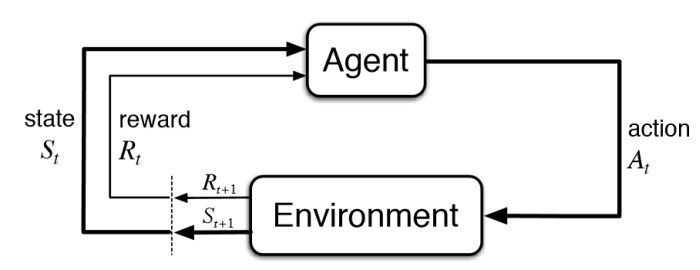

-
- What
	- Reinforcement Learning adalah bagian dari machine learning
		- Usually we categorize machine learning as supervised, unsupervised, and reinforcement learning
	- Supervised and unsupervised learning are usually one-shot,
	  myopic, considering instant rewards; while reinforcement learning is sequential, far-sighted, considering long-term accumulative rewards. (https://arxiv.org/pdf/1810.06339.pdf)
	- **Reinforcement learning is usually about sequential decision making**
	- 
		- An RL agent interacts with an environment over time. At each time step t, the agent receives a state st in a state space S, and selects an action at from an action space A, following a policy π(at|st), which is the agent’s behavior, i.e., a mapping from state st to actions at. The agent receives a scalar reward rt, and transitions to the next state st+1, according to the environment dynamics, or model, for reward function R(s, a), and, state transition probability P(st+1|st, at), respectively
-
- EXPLORATION VS. EXPLOITATION
	- The exploration vs exploitation dilemma is about the agent needs to exploit the currently best action to maximize rewards greedily, yet it has to explore the environment to find better actions, when the policy is not optimal yet, or the system is non-stationary.
	- An RL agent needs to trade off between exploration of uncertain policies and exploitation of the
	  current best policy, a fundamental dilemma in RL
-
- Deep Reinforcement Learning
	- We obtain deep reinforcement learning (deep RL) methods when we use deep neural networks to
	  represent the state or observation, and/or to approximate any of the following components of reinforcement learning: value function, vˆ(s; θ) or qˆ(s, a; θ), policy π(a|s; θ), and model (state transition function and reward function).
	- Deep RL algorithms are able to take in very large inputs (e.g. every pixel rendered to the screen in a video game) and decide what actions to perform to optimize an objective (eg. maximizing the game score) (https://en.wikipedia.org/wiki/Deep_reinforcement_learning#cite_note-francoislavet2018-1)
	- Deep reinforcement learning has been used for a diverse set of applications including but not limited to robotics, video games, natural language processing, computer vision, education, transportation, finance and healthcare. [1]
	-