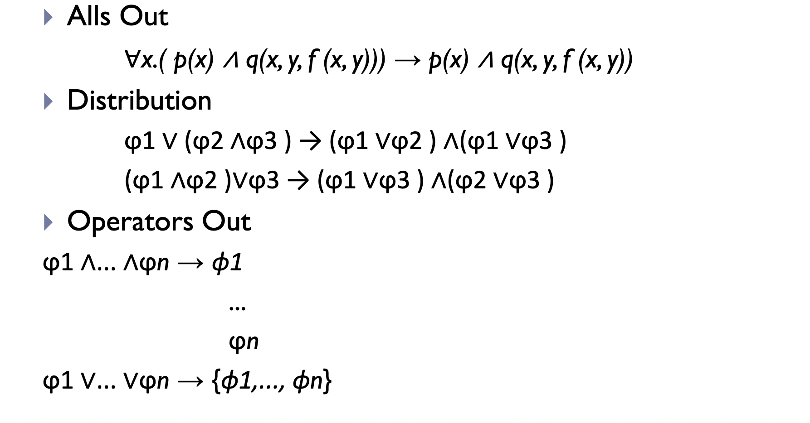
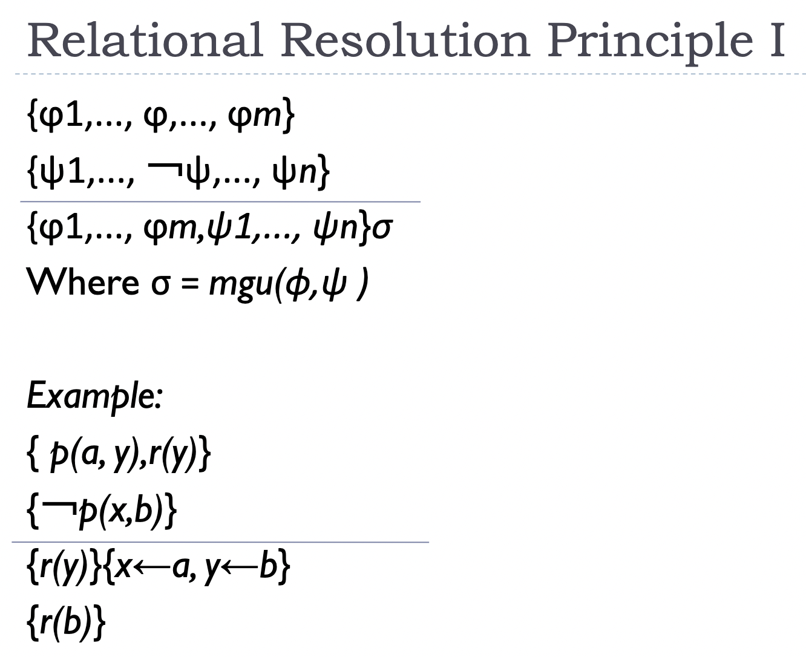

- Membuat kita bisa menggambarkan keterhubungan
	- 
-
- Syntax:
	- variable
		- u-z
	- constant
	- arity
	- term
		- either variable, constant, atau functional term
	- sentence
		- type:
			- relational sentence
			- logical sentence
			- quantified sentence
		- sentence disebut ground kalau tidak ada variable
		- disebut open kalau mengandung free variable
			- 
-
- Logical Entailment:
	- Metode pemeriksaan langsung
	- Proof Method
		- Inference
		  collapsed:: true
			- 
			- 
			- 
			- 
			- 
			-
		- Axiom Schemata
		  collapsed:: true
			- 
			- 
			- 
			-
			- 
			-
			- 
			- 
			-
		- Resolution
			- cara kerja: ubah ke clausal form, pake mgu
			- 
			- 
			- 
			- 
			- 
			-
			- Substitution
				- 
				- 
				- 
				- 
			-
			- Cara resolution:
				- pake mgu hasil dari clausal form, buktikan unsatisfiable
				- 
			-
			- Contoh:
				- buat ke bentuk clausal
					- 
				- buktikan unsatisfiable dengan mgu
					- 
				-
		-
	-
	-
	-