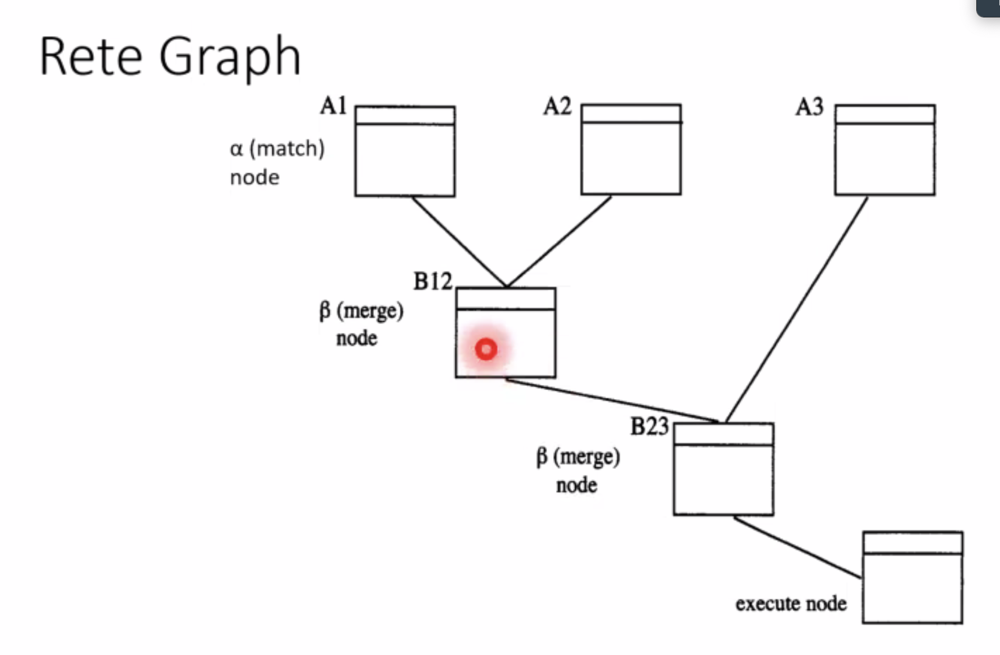

- rete adalah network
	- direct acyclic graph
	- digunakan untuk menambah efisiensi of forward chaining system
-
- key idea:
	- variable binding dengan mencocokkan antecendent(if) aturan
		- contoh, if a -> b disimpan
		- ketika ketemu a, langsung keluar b, ga perlu compute ulang
-
- 2 advantages:
	- many rules share antecendent
	- tidak banyak rule
-
- disatvantages:
	- big memory usage, menggunakan graf
-
- 
-
	- node menunjukkan set of variable binding
	- ...
-
- Cara membangun graf:
	- untuk setiap antecendent, buat alpha node(match node) di paling atas
	- buat merge node
-
-