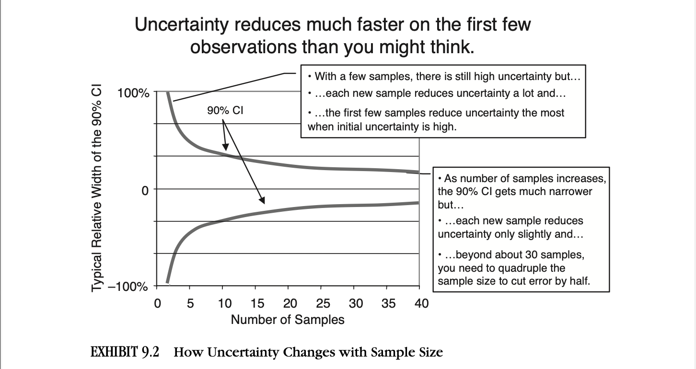
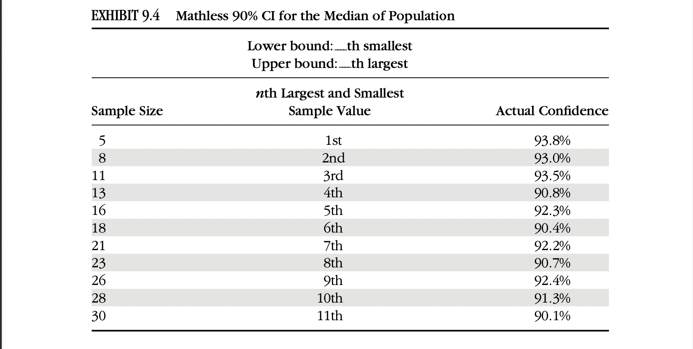

- ### Sampling Reality: How Observing Some Things Tells Us about All Things
-
- Misal kita ingin melakukan pengujian kekuatan bata. Untuk mengetes kekuatan bata, kita harus mengetes setiap batanya. Sampling memberikan kita kemudahan untuk hanya mengetes beberapa bata, dan mendapatkan informasi terhadap keseluruhan bata yang ada
-
- Measurement dalam reality:
	- population
		- keseluruhan batu bata yang ada
	- census
		- pengetesan semua batu bata yang ada
		- tidak cocok karena kita bisa saja merusak semua batu bata yang ada
	- sample
		- census ke beberapa anggota populasi
	-
- Sampling:
	- melihat sedikit hal untuk mengetahui banyak hal yang tidak kita lihat
	- how to measure the “immeasurable.”
	- lebih menggunakan pendekatan 'kalibrasi estimator', yang pengkalibrasiannya dilakukan setiap pengambilan sampel lain, dibandingkan dengan mencari statistika deskriptif dari populasi (yang sangat sulit untuk dicari)
	-
	-
-
- Pada tahun 1908, Gosset menciptakan suatu metode baru untuk mencari confidence interval dengan sample yang lebih sedikit. disebut sebagai t-statistic.
	- t-statistic miirp dengan z-score, berbentuk normal distributin. Tapi, karena t statistic menggunakan data yang lebih sedikit, confidence intervalnya lebih lebar. ketika n=30, interval yang dibentuk oleh t-statistic hampir sama dengan z-score.
- Step untuk membuat confidence interval dengan menggunakan t-statistic:
	- compute variance
	- compute standard deviation
	- kalikan t-stat berdasarkan banyak sampel ke standard deviation. ini adalah sample error
	- confidence interval = mean +- sample error
	- ini yang disebut sebagai calibrated estimator, ketika sample yang diambil ditambah walaupun hanya satu, estimator nya pun berbeda, menghasilkan estimator yang lebih baik. (karena pengali upper dan lower bound nya/sample error lebih kecil)
	-
	-
- Statistical Significance: A Matter of Degree
	- Uncertainty reduces much faster on the first few observations than you might think.
	- 
	- When you have a lot of uncertainty, a few samples greatly reduce it, especially with relatively homogeneous populations.
	- In some cases, calibrated estimators were able to reduce uncertainty even with only one sample—which is impossible with the traditional statistics we just discussed.
	-
-
- When Outliers Matter Most
	- Some samples will temporarily narrow the 90% CI, but some “outliers” are so much bigger than the rest of the population that, if they came up in the sample, they would greatly widen the CI again.
	- If we survey 5 customers about how many hours per week they spend watching reality TV shows, and their answers are 0, 0, 1, 1, and 4 hours, the lower bound of the 90% CI will be a negative value—which makes no sense at all.
-
- The Easiest Sample Statistics Ever
	- Nonconverging data can be a big problem for someone trying to measure.
	- Mathless 90% CI for the Median of Population adalah pendekatan yang tidak terpengaruh terhadap masalah nonconverging data.
	- Cara kerja dari metode ini adalah, misal If we sample 8 items, the largest and smallest values would make a range much wider than a 90% CI (actually, about 99.2% CI). But it turns out that if we take the second largest and smallest values, we get back to something closer to a 90% CI—about 93%. If we sample 11, the 90% CI can be approximated with the third largest and third smallest values.
	- if you can sample 18 things, the sixth largest and sixth smallest values out of the 18 samples approximated the upper and lower bounds for a 90% CI
	- 
	- There is no computing sample variance, no square roots, and no t-statistics tables.
	- I call this the mathless 90% CI
	- This mathless approach generates a 90% CI just slightly wider than the t-statistic, but it avoids some of the problems of the t-statistic.
	- completely avoids the problem of nonconverging estimates (karena pendekatan yang digunakan adalah median)
	-
	-
- A Biased Sample of Sampling Methods
	- Population Proportion Sampling
		- Sometimes you want to estimate what proportion of a population has a particular characteristic
		- sistem kerjanya sama dengan mencari confidence interval
	- Spot Sampling
		- Spot sampling is a variation of population proportion sampling. Spot sam- pling consists of taking random snapshots of people, processes, or things in- stead of tracking them constantly throughout a period of time.
		- For example, if you wanted to see the share of time that employees spend in a given ac- tivity, you randomly sample people through the day to see what they were doing at that moment. If you find that in 12 instances out of 100 random samples, people were on a conference call, you can conclude they spend about 12% of the time on conference calls (90% CI is 8% to 18%). At a particular point in time they are either doing this activity or not, and you are simply asking what share of the time this takes.
	- Clustered Sampling
		- “Clustered sampling” is defined as taking a random sample of groups, then conducting a census or a more concentrated sampling within the group.
		- For example, if you want to see what share of households has satellite dishes or correctly separates plastics in recycling, it might be cost effective to randomly choose several city blocks, then conduct a complete census of everything in a block.
		- Zigzagging across town to individually selected households would be time consuming
	- Stratified Samples
		- In “stratified sampling,” different sample methods and/or sizes are used for different groups within a population
		- This method may make sense when you have some groups within a population that vary widely from each other but are fairly homogeneous inside a group
	- Serial Sampling
		- In 1943, statisticians work- ing for the Allies developed a method for estimating production levels based on the serial numbers of captured tanks.
		- By treating captured tanks as a random sample of the entire population of tanks, the statisticians saw that they could compute the odds of various levels of production.
		- Working backward, it would seem unlikely, for exam- ple, to capture by chance alone 10 tanks produced in the same month with serial numbers all within 50 increments of each other, if 1,000 tanks were produced that month. It is more likely that randomly selecting from 1,000 tanks would give us a more dispersed series of serial numbers than that. If, however, only 80 tanks were produced that month, then getting a sample of 10 tanks with that narrow range of serial numbers seems at least feasible.
-
- Experiment
	- The word “experiment” could be broadly used to mean any phenomena deliberately created for the purpose of observation. You “experiment” when you run a security test to see if and how quickly a threat is responded to.
	-
- Seeing Relationships in the Data: An Introduction to Regression Modeling
	- Clearly, the experiment example given earlier in this chapter shows how something that has many possible causes can be traced to a particular cause by comparing a test group to a control group. But using a control and a test group is really just one way to separate out the effect of one single variable from all the noise that exists in any business. We can also consider how well one variable correlates with another.
	- orrelation between two sets of data is expressed as a number be- tween +1 and −1. A correlation of 1 means the two variables move in perfect harmony: As one increases, so does the other. A correlation of −1 also indicates two closely related variables, but as one increases, the other decreases in lockstep. A correlation of 0 means they have nothing to do with each other.
	-
	-