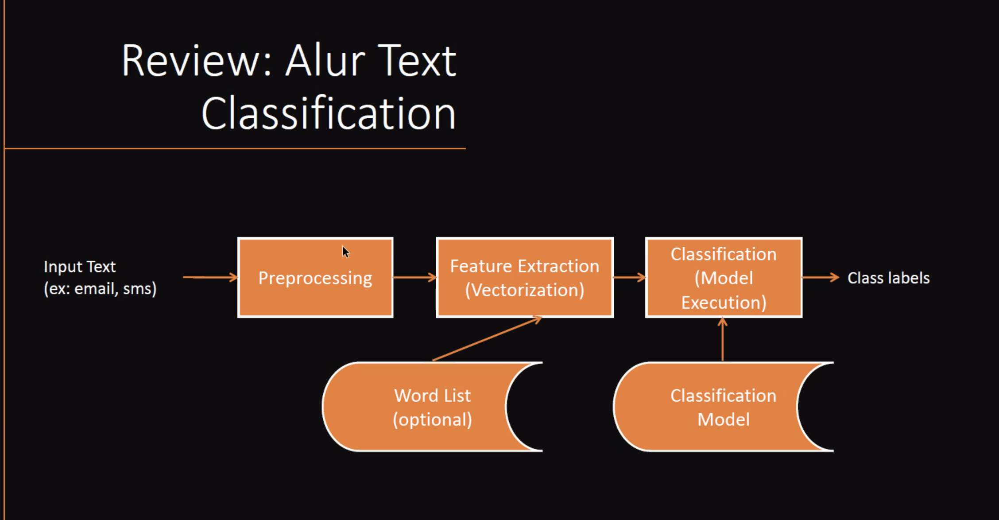

- Bertujuan memberikan label atau kategori untuk suatu dokumen
- Text input:
	- short document
	- long document
	- user generated, non formal content
-
- Basic Approach:
	- preprocess
	- feature extraction
	- classification
-
- Alur text classification:
  
-
- Preprocessing
	- refer ke [[Basic NLP]]
-
-
- Feature extraction / Vectorization:
	- ketika satu token/kata direpresentasikan dengan satu nilai, kita tidak bisa melihat kedekatan antar kata
	- makanya direpresentasikan ke dalam vektor
		- word2vec
		- bag of words
	- bag of words banyak sekali feature/kolomnya
		- kita bisa pake feature reduction
			- lemmatization
			- stemming
			- TF/IDF
				- tidka memerhatikan label
			- TODO Mutual information
				- memeratikan label
			-
-
-
- Sentiment Analysis:
	- Permasalahan yang sering terjadi:
		- NE Recognition
		  ketika ada NE yang cenderung sentiment ke suatu + atau -, ketika ada kata tersebut di test data, model akan bias mengklasifikasi
			- Contoh: di data training, `ahok` sngat banyak yang negatif. ketika test ada kata `ahok`, langsung diklasifikasi jadi negatif, karena model sangat bias
			- makanya NE recognition penting di dalam sentiment analysis
		- Anaphora resolution
			- TODO ini apa ya
		- Sarcasm/irony
			- pemerintah makin hebat aja, bbm naek teroooss
				- ini sebenarnya sentiment negatif, tapi malah keliatan positif karena dibungkus dengan sarkasme
		- Bahasa non-formal
		- sentiment relative
			- TODO ?
		- mengandung + dan - di dalam satu kata
			- 3 sinyal jelek! mending telkomsel bagus
		- Perbandingan
			- xl lebih murah dari telkomsel tapi sinyal lebih jelek
-
- [[BERT]]:
	- https://colab.research.google.com/drive/1eHl781lqJMryBfaSK8t7N0y43Tb5mgQW?usp=sharing
	- https://ieeexplore.ieee.org/document/9640280
	- https://colab.research.google.com/drive/1yFphU6PW9Uo6lmDly_ud9a6c4RCYlwdX#scrollTo=c8HDKzBai5dL
-