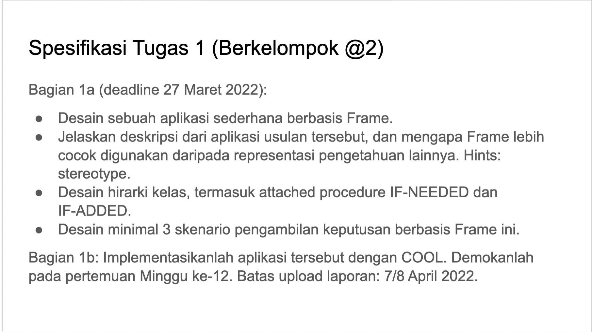

- Jadwal:
	- Senin: COOL Travel
	- Selasa: Text summarization, Reinforcement Learning
	- Rabu: Deep Reinforcement Learning, COOL Travel
	- Kamis: Daftar indoNLU, Traditional ML
	- Jumat: Non Contextual Embedding
	- Sabtu: Contextual Embedding
	- Minggu: COOL medical history, interim report ADB 2
	-
-
- NLP
	- spec [link](https://docs.google.com/document/d/1PTbcS2VLOUM1NUXaXmwnGF8tjxhhfHbSMNoVbAzD_Jc/edit)
	- Senin, 28 Maret 2022 pukul 09.00 WIB
		- id:: 623692fa-4647-43e4-b8fe-a834c6daee56
		  1. Traditional ML
		  Deadline Kamis, 24 Maret 2022 pukul 23.59
		  Misalnya: melakukan ekstraksi fitur menggunakan tf-idf, kemudian menggunakan algoritma decision tree learning untuk modeling
		- 2. Non Contextual Embeddings
		  Deadline Jumat, 25 Maret 2022 pukul 23.59
		  Misalnya: menggunakan glove / word2vec / fasttext untuk ekstraksi fitur, kemudian menggunakan RNN, CNN, dan atau FCN untuk modeling
		- 3. Contextual Embeddings
		  Deadline Sabtu, 26 Maret 2022 pukul 23.59
		  Misalnya: fine-tuning BERT, GPT-3, dll.
		  Untuk fine tuning BERT, bisa menggunakan trainer class dari transformer di huggingface (https://huggingface.co/docs/transformers/training)
	- Dataset:
		- NER https://github.com/indobenchmark/indonlu/tree/master/dataset/nerp_ner-prosa
		- POS Tag
		  https://github.com/indobenchmark/indonlu/tree/master/dataset/posp_pos-prosa
		- Keyword Extraction
		  https://github.com/indobenchmark/indonlu/tree/master/dataset/keps_keyword-extraction-prosa
-
- Knowledge Representation & Reasoning
	- Deadline: Kamis 24 Maret 2022 pukul 06.00 WIB
		- 
	- Deadline: Minggu 27 Maret 2022 pukul xx.xx WIB
		- 
		-
-
- ADB
	- [link](https://cdn-edunex.itb.ac.id/37966-Data--Business-Analysis/73257-Module-09-Bayesian-Probability/1647300756839_IF5175_M9_P1_EDABayes_TextMessenger.pdf)
	- Spec
		- 1. Kerjakan tugas dalam kelompok seperti biasanya.
		- 2. Pelajari   tentang text classification, dan bahan lainnya jika perlu.
		- 3. Analisislah text pada sebuah wa/line/telegram group di mana Anda ada di dalamnya
		- 4. Kembangkan 10 pertanyaan yang dapat dijawab dengan EDA
		- 5. Kembangkan 2 pertanyaan yang dapat dijawab dengan Bayesian Probability (sebagai inspirasi, Anda dapat gunakan bahasan pada slide dari Stanford)
	- Milestones
		- 1.Interim Report 1 (what, how it works): m10 (Senin, 21 Maret 2022, 12.00, via
		  Edunex)
		- 2. Interim Report 2 (update: what, how it works, optional, if necessary): m11 (Senin, 28
		  Maret 2022, 12.00, via Edunex)
		- 3. Final Report (Implementasi, Presentasi): m12 (Senin, 4 April 2022, 12.00, via Gform)
		-
-
- Thesis
	- Deadline: Rabu, 23 Maret 2022 pukul 17.00
		- Bab 2 Text Summarization
		- Bab 2 Reinforcement Learning
		- Literature study: Deep Reinforcement Learning
		-