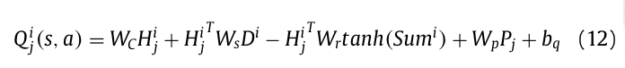
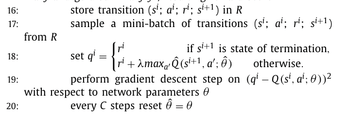
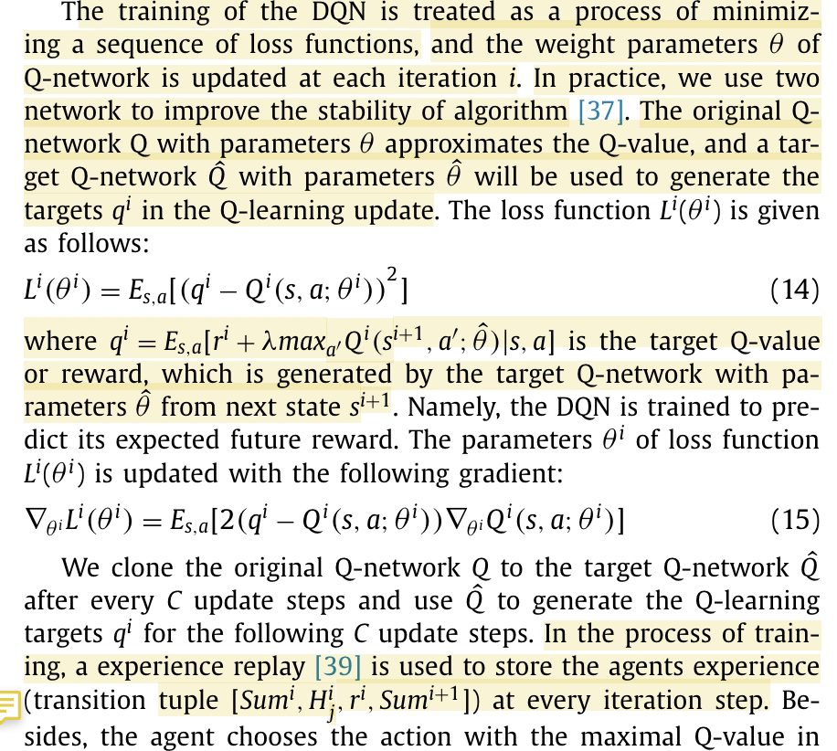

- MPSI: Selasa 10 Mei 09.15 - 12.15 (7604)
- Finish Proposal: 11 Mei 23.59
- Daftar Sidang: 12 Mei 09.00
- ADB: Selasa 17 Mei 09.15 - 12.15 (7606)
- RPP: Kamis 19 Mei 09.15 - 12.15 (7608)
- NLP: Senin 23 Mei 09.15 - 12.15 (R. MM Lt 4)
- Metode penelitian: Rabu 25 Mei 09.15 - 12.15 (Online)
-
-
- Pertanyaan:
	- Q learning itu model-free. Apa artinya? apa contoh yang bukan model-free?
	- kalo di deep q network ini, apa aja 4 komponen reinforcement learningnya?
	- cari kelebihan off policy dibanding dengan on policy
	- apa itu markov decision process (MDP)
	- bedanya q learning, deep q learning, dan deep q network
		- https://ai.stackexchange.com/questions/25913/what-is-the-difference-between-q-learning-deep-q-learning-and-deep-q-network
	- why going deep in q learning?
		- https://theaisummer.com/Deep_Q_Learning/
	- q-value function sama dengan action-value function?
	-
	-
- Yang masih bingung:
	- apa itu Positional embedding yang ada di dalem equation 12
		- 
	- Apa itu Q-hat
		- {:height 263, :width 431}
		- masih bingung di bagian ini: we clone the original q network q to the target q network Qhat
		- {:height 583, :width 435}
	- Apa itu experience replay?
	- Apa itu off policy? apa policy di dalem DQN?
	- bedanya penelitian terkait dgn bab 2 yang sbeelum2nya?
	- di bab 1 perlu timeline?
	- apa aja yang biasanya ditanya di seminar?
		- apakah sampe ke apa itu bert, gimana bert kerja
		- atau cuma apa yang mau kita buat
		-
		-
	- dari tiga dataset, apakah summary nya adalah gold summary ataua human summary biasa
		- cari tau cara pembuatan tiga dataset ini
	- kelemahan abstraktif
		- cohesive vs coherent
	- action = memilih indeks kalimat, buat kosisten
	- jkonsisten bukan teks, tapi dokumen
	- tambah informasi dataset ke bab 2
	- hipotesis: dieksplisit premis dan hipotesisnya
	- evaluation metrics selain rouge?
		- pyramid, dll
	- tambahkan penelitian terkait
		- bahasa indonesia (ijeei)
		- lapata
	- ganti q value di gambar jadi q(s, a | tetha) biar konsisten sama algoritmanya
	-
	-