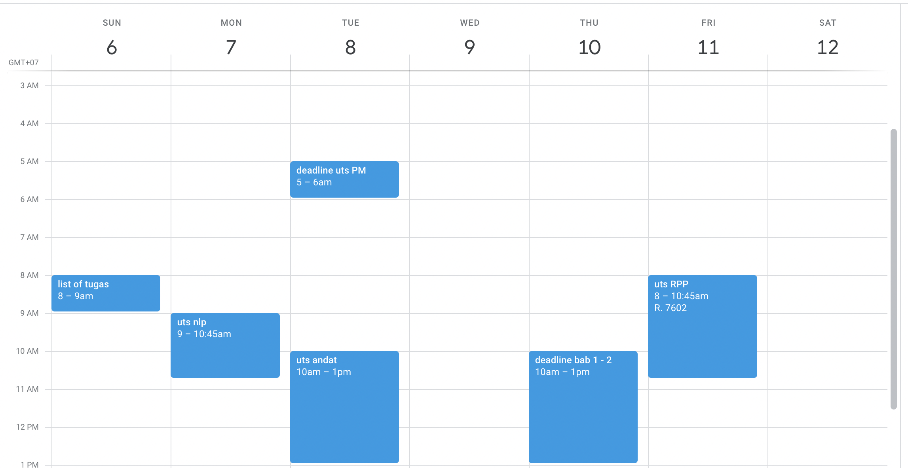

- 
-
- [[NLP]]
	- Basic NLP Tools
	- Text Classification
	- DONE Word Representation
	  :LOGBOOK:
	  CLOCK: [2022-03-10 Thu 13:19:54]--[2022-03-10 Thu 13:19:55] =>  00:00:01
	  CLOCK: [2022-03-10 Thu 13:19:57]--[2022-03-10 Thu 13:19:57] =>  00:00:00
	  CLOCK: [2022-03-10 Thu 13:19:58]--[2022-03-10 Thu 13:19:58] =>  00:00:00
	  :END:
	- DONE Sequential Labelling
	  :LOGBOOK:
	  CLOCK: [2022-03-10 Thu 13:19:54]--[2022-03-10 Thu 13:19:59] =>  00:00:05
	  :END:
	- DONE Seq2seq transformation
	  :LOGBOOK:
	  CLOCK: [2022-03-10 Thu 13:19:55]--[2022-03-10 Thu 13:19:59] =>  00:00:04
	  :END:
-
- [[ADB]]
	- DONE What is Data and Business Analytics
	- DONE Review Probabilitas dan Statistika
	- DONE EDA
	- DONE Measurement
	- DONE Correlation Causality
	- DONE Hypothesis Testing
-
- [[MPSI]]
	- DONE Review tugas 1
	- DONE Mulai buat tugas 2
-
- [[Proposal Thesis]]
	- Bab 1
	- Bab 2
		- Reinforcement Learning NLP
		- NEAT
		- Masukin hasil review paper ke dalem bab 2
-
- [[RPP]]
	- [[Propositional Logic]]
		- DONE simple sentence
		- DONE compound sentence
		- DONE reverse evaluation
		- semantic reasoning
			- DONE truth table
			  :LOGBOOK:
			  CLOCK: [2022-03-10 Thu 13:23:48]--[2022-03-10 Thu 13:23:48] =>  00:00:00
			  CLOCK: [2022-03-10 Thu 13:23:50]--[2022-03-10 Thu 13:23:50] =>  00:00:00
			  CLOCK: [2022-03-10 Thu 13:23:51]--[2022-03-10 Thu 13:23:51] =>  00:00:00
			  CLOCK: [2022-03-10 Thu 13:23:52]--[2022-03-10 Thu 13:23:52] =>  00:00:00
			  CLOCK: [2022-03-10 Thu 13:23:52]--[2022-03-10 Thu 13:23:53] =>  00:00:01
			  CLOCK: [2022-03-10 Thu 13:24:00]--[2022-03-10 Thu 13:24:01] =>  00:00:01
			  CLOCK: [2022-03-10 Thu 13:24:01]--[2022-03-10 Thu 13:24:02] =>  00:00:01
			  CLOCK: [2022-03-10 Thu 13:24:04]--[2022-03-10 Thu 13:24:04] =>  00:00:00
			  CLOCK: [2022-03-10 Thu 13:28:32]--[2022-03-10 Thu 13:28:33] =>  00:00:01
			  CLOCK: [2022-03-10 Thu 13:28:37]--[2022-03-10 Thu 13:28:37] =>  00:00:00
			  CLOCK: [2022-03-10 Thu 13:28:40]--[2022-03-10 Thu 13:28:40] =>  00:00:00
			  CLOCK: [2022-03-10 Thu 13:28:49]--[2022-03-10 Thu 13:28:50] =>  00:00:01
			  CLOCK: [2022-03-10 Thu 13:28:50]--[2022-03-10 Thu 13:28:52] =>  00:00:02
			  CLOCK: [2022-03-10 Thu 13:28:53]--[2022-03-10 Thu 13:28:55] =>  00:00:02
			  :END:
			- DONE validity checking
			  :LOGBOOK:
			  CLOCK: [2022-03-10 Thu 13:28:38]--[2022-03-10 Thu 13:28:38] =>  00:00:00
			  CLOCK: [2022-03-10 Thu 13:28:39]--[2022-03-10 Thu 13:28:39] =>  00:00:00
			  :END:
			- DONE unsatisfiability checking
		- proof method
			- DONE rule of inference
			- DONE axiom schemata
			- DONE propositional resolution
	- [[Relational Logic]]
	  collapsed:: true
		- Proof method:
			- DONE rule of inference
			- DONE axiom schemata
			- resolution principle
				- DONE clausal form (INSEADO)
				- DONE substitution
				- DONE pattern matching
				- DONE unification
				- DONE resolution principle
					- principle I
					- principle II
					- principle III
		- DONE Answer Extraction
	- [[Non-Monotonic Logic]]
		- DONE kelebihan kelemahan ML vs NML
			- NML: mendefinisikan strong yet flexible system untuk mengatasi situasi inncomplete knowledge
		- NM Reasoning type
			- DONE Autoepistemic Reasoning
			- DONE Default Reasoning
		- DONE Answet Set Programming
	- Rule-based system
	  collapsed:: true
		- DONE Forward Chaining
		- DONE Backward Chaining
	- Probabilistic Reasoning
	  collapsed:: true
		- DONE joint probability
		- DONE independence
		- DONE conditional independence
		- DONE bayes rule
		-
-